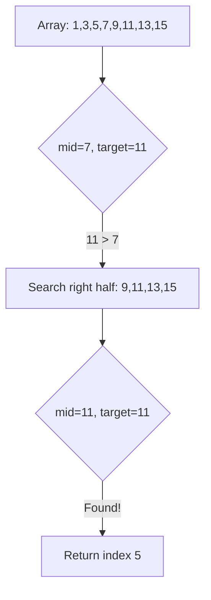
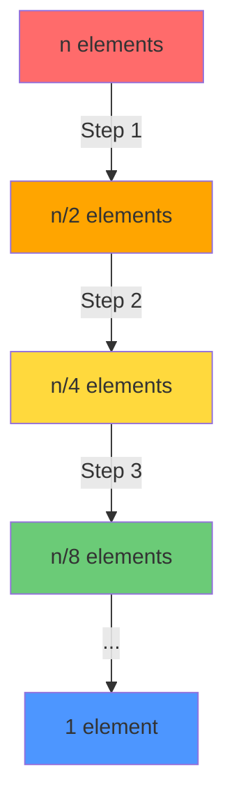
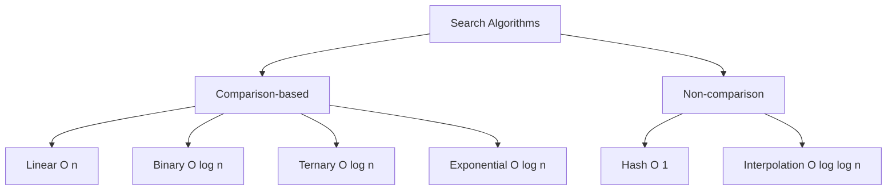

# Binary Search

## Table of Contents

1. [Implementation Overview](#1-implementation-overview)
2. [Codebase Analysis](#2-codebase-analysis)
3. [Core Operations & Time Complexities](#3-core-operations--time-complexities)
4. [Design Patterns Used](#4-design-patterns-used)
5. [Industry Patterns & Real-World Applications](#5-industry-patterns--real-world-applications)
6. [Performance Optimizations](#6-performance-optimizations)
7. [Edge Cases & Error Handling](#7-edge-cases--error-handling)
8. [Usage Examples](#8-usage-examples)
9. [Best Practices & Gotchas](#9-best-practices--gotchas)
10. [Related Patterns & Alternatives](#10-related-patterns--alternatives)

---

## 1. Implementation Overview

### What is Binary Search?

Binary Search is a **divide-and-conquer search algorithm** that efficiently finds an element in a **sorted array** by repeatedly dividing the search space in half.



### Visual Representation

```
Target: 11

Step 1: [1, 3, 5, 7, 9, 11, 13, 15]
              ↑ mid=7
         11 > 7, go right

Step 2:             [9, 11, 13, 15]
                        ↑ mid=11
                    Found! Return index 5
```

### Codebase Coverage

| File                  | Topic                 | Patterns                                             |
| --------------------- | --------------------- | ---------------------------------------------------- |
| `BinarySearch1.java`  | Basic variants        | Ascending, Descending, Order-agnostic, Recursive, 2D |
| `BinarySearch2.java`  | First/Last occurrence | Floor, Ceiling, Count occurrences                    |
| `BinarySearch3.java`  | Advanced search       | Minimum difference, Infinite array                   |
| `BinarySearch4.java`  | Bitonic array         | Peak finding, Mountain array                         |
| `BinarySearch5.java`  | Rotated array         | Search, Find minimum, Count rotations                |
| `BinarySearch6.java`  | Allocation problems   | Book allocation, Ship capacity                       |
| `BinarySearch7.java`  | Rate problems         | Eating speed (Koko's bananas)                        |
| `BinarySearch8.java`  | Divisor problems      | Smallest divisor with threshold                      |
| `BinarySearch9.java`  | Distribution          | Minimize maximum products                            |
| `BinarySearch10.java` | Spacing problems      | Aggressive cows                                      |
| `BinarySearch11.java` | Median finding        | Median of two sorted arrays                          |
| `BinarySearch12.java` | K-th element          | K-th element in two sorted arrays                    |
| `BinarySearch13.java` | Unique element        | Single non-duplicate                                 |

---

## 2. Codebase Analysis

### Basic Binary Search (`BinarySearch1.java`)

```java
static void binarySearch(int[] arr, int key) {
    int start = 0;
    int end = arr.length - 1;

    while (start <= end) {
        int mid = start + (end - start) / 2;  // Overflow-safe mid calculation

        if (arr[mid] == key) {
            System.out.println("Found at index: " + mid);
            return;
        } else if (arr[mid] < key) {
            start = mid + 1;  // Search right half
        } else {
            end = mid - 1;    // Search left half
        }
    }
    System.out.println("Not found");
}
```

### Order-Agnostic Binary Search

```java
static void binarySearchOrderAgnostic(int[] arr, int key) {
    int start = 0;
    int end = arr.length - 1;

    // Determine order by comparing first and last elements
    if (arr[start] <= arr[end]) {
        binarySearch(arr, key);         // Ascending
    } else {
        binarySearchDecsending(arr, key); // Descending
    }
}
```

### First/Last Occurrence (`BinarySearch2.java`)

```java
static int binarySearchFirstOccurence(int[] arr, int key) {
    int ans = -1;
    int start = 0;
    int end = arr.length - 1;

    while (start <= end) {
        int mid = (start + end) / 2;
        if (arr[mid] == key) {
            ans = mid;
            end = mid - 1;  // Continue searching left for first occurrence
        } else if (arr[mid] > key) {
            end = mid - 1;
        } else {
            start = mid + 1;
        }
    }
    return ans;
}

static int binarySearchLastOccurence(int[] arr, int key) {
    int ans = -1;
    int start = 0;
    int end = arr.length - 1;

    while (start <= end) {
        int mid = (start + end) / 2;
        if (arr[mid] == key) {
            ans = mid;
            start = mid + 1;  // Continue searching right for last occurrence
        } else if (arr[mid] > key) {
            end = mid - 1;
        } else {
            start = mid + 1;
        }
    }
    return ans;
}
```

### Floor and Ceiling Functions

```java
// Floor: Greatest element <= key
static int binarySearchFloor(int[] arr, int key) {
    int ans = -1;
    int start = 0;
    int end = arr.length - 1;

    while (start <= end) {
        int mid = (start + end) / 2;
        if (arr[mid] == key) {
            ans = arr[mid];
        } else if (arr[mid] > key) {
            end = mid - 1;
        } else {
            start = mid + 1;
            ans = arr[mid];  // Update floor when moving right
        }
    }
    return ans;
}

// Ceiling: Smallest element >= key
static int binarySearchCeiling(int[] arr, int key) {
    int ans = -1;
    int start = 0;
    int end = arr.length - 1;

    while (start <= end) {
        int mid = (start + end) / 2;
        if (arr[mid] == key) {
            ans = mid;
        } else if (arr[mid] < key) {
            start = mid + 1;
        } else {
            end = mid - 1;
            ans = arr[mid];  // Update ceiling when moving left
        }
    }
    return ans;
}
```

### Rotated Sorted Array (`BinarySearch5.java`)

```java
static int searchInRotatedSortedArray(int[] arr, int target) {
    int start = 0;
    int end = arr.length - 1;
    int ans = -1;

    while (start <= end) {
        int mid = start + (end - start) / 2;

        if (arr[mid] == target) {
            ans = mid;
        }

        // Determine which half is sorted
        if (arr[start] <= arr[mid]) {
            // Left half is sorted
            if (target >= arr[start] && target <= arr[mid]) {
                end = mid - 1;  // Target in left half
            } else {
                start = mid + 1; // Target in right half
            }
        } else {
            // Right half is sorted
            if (target >= arr[mid] && target <= arr[end]) {
                start = mid + 1; // Target in right half
            } else {
                end = mid - 1;   // Target in left half
            }
        }
    }
    return ans;
}
```

### Binary Search on Answer (`BinarySearch6.java`)

```java
// Book Allocation Problem
static int bookAllocation(int[] books, int students) {
    if (books.length < students) return -1;

    int res = -1;

    // Search space: [max single book, sum of all books]
    int start = Integer.MIN_VALUE;
    int end = 0;
    for (int book : books) {
        start = Math.max(start, book);  // Minimum possible answer
        end += book;                     // Maximum possible answer
    }

    while (start <= end) {
        int mid = start + (end - start) / 2;

        if (isAllocationPossible(mid, students, books)) {
            res = mid;
            end = mid - 1;   // Try to minimize
        } else {
            start = mid + 1; // Need more pages per student
        }
    }
    return res;
}

static boolean isAllocationPossible(int maxPages, int students, int[] books) {
    int studentCount = 1;
    int pages = 0;

    for (int book : books) {
        if (pages + book > maxPages) {
            studentCount++;
            pages = 0;
        }
        pages += book;

        if (studentCount > students) return false;
    }
    return studentCount <= students;
}
```

### Median of Two Sorted Arrays (`BinarySearch11.java`)

```java
static double findMedianSortedArrays(int[] nums1, int[] nums2) {
    int n1 = nums1.length;
    int n2 = nums2.length;

    // Ensure nums1 is smaller for efficiency
    if (n1 > n2) {
        return findMedianSortedArrays(nums2, nums1);
    }

    int N = n1 + n2;
    int start = 0;
    int end = n1;

    while (start <= end) {
        int cut1 = start + (end - start) / 2;
        int cut2 = (N / 2) - cut1;

        int l1 = cut1 == 0 ? Integer.MIN_VALUE : nums1[cut1 - 1];
        int l2 = cut2 == 0 ? Integer.MIN_VALUE : nums2[cut2 - 1];
        int r1 = cut1 == n1 ? Integer.MAX_VALUE : nums1[cut1];
        int r2 = cut2 == n2 ? Integer.MAX_VALUE : nums2[cut2];

        if (l1 <= r2 && l2 <= r1) {
            // Valid partition found
            if (N % 2 == 0) {
                return (double) (Math.max(l1, l2) + Math.min(r1, r2)) / 2;
            } else {
                return (double) Math.min(r1, r2);
            }
        } else if (l1 > r2) {
            end = cut1 - 1;
        } else {
            start = cut1 + 1;
        }
    }
    return 0.0;
}
```

---

## 3. Core Operations & Time Complexities

### Complexity Analysis Table

| Problem Type            | Time Complexity       | Space Complexity |
| ----------------------- | --------------------- | ---------------- |
| Basic Binary Search     | **O(log n)**          | O(1)             |
| First/Last Occurrence   | **O(log n)**          | O(1)             |
| Floor/Ceiling           | **O(log n)**          | O(1)             |
| Rotated Array Search    | **O(log n)**          | O(1)             |
| Rotated with Duplicates | **O(n)** worst        | O(1)             |
| Peak Element            | **O(log n)**          | O(1)             |
| Bitonic Array Search    | **O(log n)**          | O(1)             |
| Binary Search on Answer | **O(log(range) × n)** | O(1)             |
| Median of Two Arrays    | **O(log(min(n,m)))**  | O(1)             |
| K-th Element            | **O(log(min(n,m)))**  | O(1)             |

### Comparison: Linear vs Binary Search

```
Array Size (n) | Linear Search O(n) | Binary Search O(log n)
──────────────────────────────────────────────────────────────
           10 |         10         |          ~3
          100 |        100         |          ~7
        1,000 |      1,000         |         ~10
       10,000 |     10,000         |         ~13
      100,000 |    100,000         |         ~17
    1,000,000 |  1,000,000         |         ~20
```

### Search Space Reduction



---

## 4. Design Patterns Used

### 1. **Divide and Conquer Pattern**

The fundamental pattern of binary search:

```java
while (start <= end) {
    int mid = start + (end - start) / 2;

    if (condition_met_at_mid) {
        // Found or narrow search
    } else if (should_search_right) {
        start = mid + 1;
    } else {
        end = mid - 1;
    }
}
```

### 2. **Binary Search on Answer Pattern**

Search over the answer space instead of array indices:

```java
// Pattern: Minimize/Maximize a value that satisfies constraint
int start = minPossibleAnswer;
int end = maxPossibleAnswer;
int result = -1;

while (start <= end) {
    int mid = start + (end - start) / 2;

    if (isFeasible(mid)) {
        result = mid;
        end = mid - 1;    // Minimize: search left
        // start = mid + 1; // Maximize: search right
    } else {
        start = mid + 1;  // Minimize: need larger value
        // end = mid - 1;   // Maximize: need smaller value
    }
}
```

### 3. **Invariant Maintenance Pattern**

Maintaining loop invariants for correctness:

```java
// Invariant: answer is always in [start, end] inclusive
// OR answer doesn't exist

while (start <= end) {
    // Invariant holds at loop start
    int mid = start + (end - start) / 2;

    if (found) return mid;
    else if (goRight) start = mid + 1;  // Invariant maintained
    else end = mid - 1;                  // Invariant maintained
}
// Invariant: start > end, so answer doesn't exist
```

### 4. **Two Halves Analysis Pattern**

For rotated arrays - determine sorted half:

```java
if (arr[start] <= arr[mid]) {
    // Left half [start, mid] is sorted
    if (target in [arr[start], arr[mid]]) {
        end = mid - 1;  // Search sorted half
    } else {
        start = mid + 1; // Search unsorted half
    }
} else {
    // Right half [mid, end] is sorted
    if (target in [arr[mid], arr[end]]) {
        start = mid + 1;
    } else {
        end = mid - 1;
    }
}
```

### 5. **Partition-Based Pattern**

For median/k-th element in two arrays:

```java
// Partition arrays such that:
// left partition size = right partition size (for median)
// All elements in left <= All elements in right

int cut1 = partition in arr1;
int cut2 = (totalSize / 2) - cut1;  // Complementary partition

// Validate: l1 <= r2 && l2 <= r1
```

### 6. **Monotonic Function Pattern**

When feasibility is monotonic:

```java
// If f(x) is feasible, then f(x+1) is also feasible (or vice versa)
// This enables binary search on the answer

// Example: Ship capacity problem
// If we can ship with capacity C, we can ship with capacity > C
// So search for minimum C
```

---

## 5. Industry Patterns & Real-World Applications

### Production Use Cases

| Application        | System              | Binary Search Usage         |
| ------------------ | ------------------- | --------------------------- |
| Database Indexing  | B-Tree, B+Tree      | Key lookup in sorted nodes  |
| Git Bisect         | Git                 | Find bug-introducing commit |
| Load Balancing     | Nginx               | Weighted distribution       |
| Version Comparison | Semantic Versioning | Version ordering            |
| IP Routing         | Routers             | CIDR range lookup           |
| Autocomplete       | Search Engines      | Prefix matching             |
| Memory Allocation  | OS Allocators       | Free block search           |

### Database B+ Tree Index

```
                    [50]                    Level 0 (Root)
                   /    \
            [20, 35]    [70, 85]            Level 1
           /   |   \    /   |   \
         [10] [25] [40][60][75][90]         Level 2 (Leaf)

Binary search at each level: O(log B) per level
Total: O(logB(n)) where B is branching factor
```

### Git Bisect Algorithm

```bash
# Git uses binary search to find bug-introducing commit
git bisect start
git bisect bad HEAD      # Current version has bug
git bisect good v1.0     # v1.0 was good

# Git binary searches through commits
# Finds the first bad commit in O(log n) steps
```

### Java's Arrays.binarySearch

```java
// Java standard library implementation
public static int binarySearch(int[] a, int key) {
    int low = 0;
    int high = a.length - 1;

    while (low <= high) {
        int mid = (low + high) >>> 1;  // Unsigned right shift (overflow-safe)
        int midVal = a[mid];

        if (midVal < key)
            low = mid + 1;
        else if (midVal > key)
            high = mid - 1;
        else
            return mid; // key found
    }
    return -(low + 1);  // key not found, return insertion point
}
```

### Google's Protocol Buffers

```cpp
// Binary search for field number in message descriptor
const FieldDescriptor* Descriptor::FindFieldByNumber(int number) const {
    // Fields are sorted by number
    // Binary search used for O(log n) lookup
    return internal::BinarySearch(fields_, number);
}
```

### LevelDB/RocksDB SSTable Search

```
SSTable Structure:
┌────────────────────────────────────────┐
│ Data Block 1 (sorted keys)             │
├────────────────────────────────────────┤
│ Data Block 2 (sorted keys)             │
├────────────────────────────────────────┤
│ ...                                    │
├────────────────────────────────────────┤
│ Index Block (binary searchable)        │
├────────────────────────────────────────┤
│ Footer                                 │
└────────────────────────────────────────┘

Lookup: Binary search index → Binary search data block
```

---

## 6. Performance Optimizations

### Optimization 1: Overflow-Safe Mid Calculation

```java
// WRONG: Can overflow for large arrays
int mid = (start + end) / 2;  // If start + end > Integer.MAX_VALUE

// RIGHT: Overflow-safe
int mid = start + (end - start) / 2;

// ALSO RIGHT: Unsigned right shift (Java specific)
int mid = (start + end) >>> 1;
```

### Optimization 2: Branch Prediction Optimization

```java
// Standard (unpredictable branches)
if (arr[mid] == key) return mid;
else if (arr[mid] < key) start = mid + 1;
else end = mid - 1;

// Branchless variant (better for modern CPUs)
// Only for specific use cases
int cmp = arr[mid] - key;
int mask = cmp >> 31;  // -1 if cmp < 0, 0 otherwise
start = mid + 1 + mask * (mid + 1 - start);
end = end + mask * (mid - 1 - end);
```

### Optimization 3: Cache-Friendly Binary Search

```java
// Eytzinger layout: store array in BFS order of binary search tree
// Improves cache locality

// Standard array: [1, 2, 3, 4, 5, 6, 7]
// Eytzinger:      [4, 2, 6, 1, 3, 5, 7]
//
// Tree view:           4
//                    /   \
//                   2     6
//                  / \   / \
//                 1   3 5   7

// Search: parent to child is sequential in Eytzinger layout
// Better prefetching by CPU
```

### Optimization 4: SIMD Binary Search

```cpp
// Using AVX2 for parallel comparison (C++ example)
// Compare 8 integers simultaneously
__m256i target_vec = _mm256_set1_epi32(target);
__m256i data_vec = _mm256_loadu_si256((__m256i*)&arr[mid-3]);
__m256i cmp = _mm256_cmpgt_epi32(data_vec, target_vec);
int mask = _mm256_movemask_ps(_mm256_castsi256_ps(cmp));
// Use mask to determine search direction
```

### Performance Comparison

| Optimization  | Speedup       | Use Case              |
| ------------- | ------------- | --------------------- |
| Standard      | 1x (baseline) | General purpose       |
| Overflow-safe | ~1x           | Large arrays          |
| Branchless    | 1.2-1.5x      | Predictable patterns  |
| Eytzinger     | 2-3x          | Repeated searches     |
| SIMD          | 3-5x          | Large datasets, C/C++ |

---

## 7. Edge Cases & Error Handling

### Edge Cases Matrix

| Scenario              | Expected Behavior        | Implementation                   |
| --------------------- | ------------------------ | -------------------------------- |
| Empty array           | Return -1 or "not found" | Check `arr.length == 0`          |
| Single element        | Check and return         | Normal flow handles              |
| All same elements     | Return any valid index   | First/last occurrence variants   |
| Element not present   | Return -1                | Loop terminates with start > end |
| Target < all elements | Return -1                | end becomes -1                   |
| Target > all elements | Return -1                | start exceeds length             |
| Integer overflow      | Use safe mid calculation | `start + (end - start) / 2`      |
| Duplicates            | Depends on variant       | First/last occurrence methods    |

### Boundary Conditions

```java
// Test cases to always include:

// 1. Empty array
binarySearch(new int[]{}, 5);  // Should return -1

// 2. Single element (found)
binarySearch(new int[]{5}, 5);  // Should return 0

// 3. Single element (not found)
binarySearch(new int[]{5}, 3);  // Should return -1

// 4. Target at beginning
binarySearch(new int[]{1, 2, 3, 4, 5}, 1);  // Should return 0

// 5. Target at end
binarySearch(new int[]{1, 2, 3, 4, 5}, 5);  // Should return 4

// 6. Target in middle
binarySearch(new int[]{1, 2, 3, 4, 5}, 3);  // Should return 2

// 7. Target not present (between elements)
binarySearch(new int[]{1, 3, 5, 7, 9}, 4);  // Should return -1

// 8. All same elements
binarySearchFirstOccurrence(new int[]{5, 5, 5, 5, 5}, 5);  // Should return 0
```

### Robust Implementation

```java
public static int robustBinarySearch(int[] arr, int target) {
    // Null check
    if (arr == null) {
        throw new IllegalArgumentException("Array cannot be null");
    }

    // Empty array check
    if (arr.length == 0) {
        return -1;
    }

    int start = 0;
    int end = arr.length - 1;

    while (start <= end) {
        // Overflow-safe mid calculation
        int mid = start + (end - start) / 2;

        if (arr[mid] == target) {
            return mid;
        } else if (arr[mid] < target) {
            start = mid + 1;
        } else {
            end = mid - 1;
        }
    }

    return -1;  // Element not found
}
```

---

## 8. Usage Examples

### Basic Search

```java
int[] arr = {1, 2, 3, 4, 5};
binarySearch(arr, 4);  // Output: Found at index: 3
binarySearch(arr, 6);  // Output: Not found
```

### First/Last Occurrence

```java
int[] arr = {1, 1, 2, 2, 3, 3, 4, 4, 5, 6};
binarySearchFirstOccurence(arr, 2);  // Returns: 2
binarySearchLastOccurence(arr, 2);   // Returns: 3

// Count occurrences
int count = lastOccurrence - firstOccurrence + 1;  // 2 occurrences
```

### Floor and Ceiling

```java
int[] arr = {1, 1, 2, 2, 3, 3, 4, 4, 6};
binarySearchFloor(arr, 5);   // Returns: 4 (greatest element <= 5)
binarySearchCeiling(arr, 5); // Returns: 6 (smallest element >= 5)
```

### Rotated Array

```java
int[] rotated = {5, 6, 7, 8, 1, 2, 3, 4};
searchInRotatedSortedArray(rotated, 2);  // Returns: 5

// Find minimum (rotation point)
findMinElementInRotatedSortedArray(rotated);  // Returns: 1

// Count rotations
findNumberOfRotations(rotated);  // Returns: 4
```

### Book Allocation

```java
// Minimize the maximum pages any student reads
int[] books = {12, 34, 67, 90};
int students = 2;
bookAllocation(books, students);  // Returns: 113
// Student 1: [12, 34, 67] = 113 pages
// Student 2: [90] = 90 pages
// Maximum = 113 (minimized)
```

### Median of Two Sorted Arrays

```java
int[] nums1 = {2};
int[] nums2 = {1, 3, 4, 5, 8, 9};
findMedianSortedArrays(nums1, nums2);  // Returns: 4.0
```

### Aggressive Cows

```java
// Maximize minimum distance between cows
int[] stalls = {1, 2, 4, 8, 9};
int cows = 3;
aggresiveCows(stalls, cows);  // Returns: 3
// Place at positions 1, 4, 8 → minimum distance = 3
```

---

## 9. Best Practices & Gotchas

### ✅ Best Practices

1. **Always use overflow-safe mid calculation**

```java
// Always use this form
int mid = start + (end - start) / 2;

// Not this
int mid = (start + end) / 2;  // Can overflow!
```

2. **Use inclusive bounds consistently**

```java
// Pattern 1: [start, end] inclusive
while (start <= end) {
    // Process mid
    start = mid + 1; // or end = mid - 1
}

// Pattern 2: [start, end) half-open
while (start < end) {
    // Process mid
    start = mid + 1; // or end = mid (not mid - 1!)
}
```

3. **Verify sorted order assumption**

```java
// For robustness in production code
public int search(int[] arr, int target) {
    assert isSorted(arr) : "Array must be sorted for binary search";
    // ... binary search logic
}
```

4. **Handle duplicates explicitly**

```java
// Be clear about which occurrence you want
int firstOccurrence = binarySearchFirst(arr, target);
int lastOccurrence = binarySearchLast(arr, target);
int anyOccurrence = binarySearch(arr, target);  // Standard
```

### ⚠️ Common Gotchas

1. **Off-by-one errors**

```java
// WRONG: Infinite loop
while (start < end) {
    mid = start + (end - start) / 2;
    if (arr[mid] < target)
        start = mid;  // Should be mid + 1!
}

// WRONG: Skips elements
while (start <= end) {
    mid = (start + end) / 2;
    if (arr[mid] < target)
        start = mid + 2;  // Skips mid + 1!
}
```

2. **Integer overflow**

```java
// For 2^30 sized arrays
int[] arr = new int[1 << 30];  // 1 billion elements
int start = 0, end = arr.length - 1;

// This overflows!
int mid = (start + end) / 2;  // Integer overflow!

// This is safe
int mid = start + (end - start) / 2;
```

3. **Not handling element not found**

```java
// WRONG: Returns wrong index
int mid;
while (start <= end) {
    mid = start + (end - start) / 2;
    if (arr[mid] == target) break;
    // ...
}
return mid;  // Wrong if element not found!

// RIGHT: Check if found
while (start <= end) {
    // ...
    if (arr[mid] == target) return mid;
    // ...
}
return -1;  // Not found
```

4. **Confusion with < vs <=**

```java
// For standard binary search
while (start <= end)  // Correct: includes single element case

// For finding insertion point
while (start < end)   // Different semantic

// They are NOT interchangeable!
```

5. **Wrong update direction**

```java
// For descending array
if (arr[mid] < target)
    end = mid - 1;    // Not start = mid + 1!
else
    start = mid + 1;  // Not end = mid - 1!
```

---

## 10. Related Patterns & Alternatives

### Search Algorithm Comparison



### When to Use Which

| Algorithm     | Prerequisite         | Time             | Use Case               |
| ------------- | -------------------- | ---------------- | ---------------------- |
| Binary Search | Sorted array         | O(log n)         | General sorted search  |
| Linear Search | None                 | O(n)             | Small arrays, unsorted |
| Interpolation | Uniform distribution | O(log log n) avg | Numeric data           |
| Exponential   | Sorted, unknown size | O(log n)         | Infinite/streaming     |
| Hash Table    | Hash function        | O(1) avg         | Frequent lookups       |
| B-Tree        | None                 | O(log n)         | Disk-based storage     |

### Related Codebase Files

| File                                                       | Relationship                   |
| ---------------------------------------------------------- | ------------------------------ |
| [LinearSearch.java](../src/LinearSearch.java)              | O(n) alternative               |
| [MatrixProblem1.java](../src/MatrixProblem1.java)          | Binary search in matrix        |
| [MatrixProblem2.java](../src/MatrixProblem2.java)          | K-th smallest in matrix        |
| [SortingAlgorithms\*.java](../src/SortingAlgorithms1.java) | Prerequisite for binary search |

### Java Standard Library

```java
import java.util.Arrays;
import java.util.Collections;

// Array binary search
int index = Arrays.binarySearch(arr, target);
// Returns: index if found, -(insertion_point + 1) if not

// List binary search
int index = Collections.binarySearch(list, target);

// With custom comparator
int index = Arrays.binarySearch(arr, target, comparator);
```

### Advanced Variants

1. **Ternary Search** - For unimodal functions
2. **Fractional Cascading** - Multiple sorted lists
3. **van Emde Boas Tree** - O(log log n) operations
4. **Fusion Tree** - O(log n / log w) with word operations

---

## References

- **CLRS**: Chapter 2.3 - Divide and Conquer
- **Java Documentation**: `java.util.Arrays.binarySearch()`
- **LeetCode**: Binary Search problem collection
- **Google Research**: Cache-Oblivious Algorithms
- **Database Internals**: B-Tree and B+Tree indexing

---

_Documentation generated for DSA Learning Repository_
_Last Updated: January 2026_
