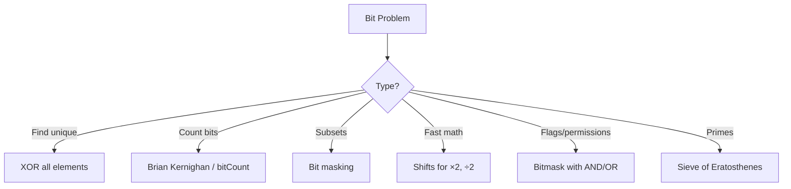

# Bit Manipulation

## Table of Contents

1. [Implementation Overview](#1-implementation-overview)
2. [Codebase Analysis](#2-codebase-analysis)
3. [Core Operations & Time Complexities](#3-core-operations--time-complexities)
4. [Design Patterns Used](#4-design-patterns-used)
5. [Industry Patterns & Real-World Applications](#5-industry-patterns--real-world-applications)
6. [Performance Optimizations](#6-performance-optimizations)
7. [Edge Cases & Error Handling](#7-edge-cases--error-handling)
8. [Usage Examples](#8-usage-examples)
9. [Best Practices & Gotchas](#9-best-practices--gotchas)
10. [Related Patterns & Alternatives](#10-related-patterns--alternatives)

---

## 1. Implementation Overview

### What is Bit Manipulation?

Bit manipulation involves directly operating on individual bits of data using bitwise operators. It's one of the most fundamental and efficient techniques in computer science, enabling O(1) operations that would otherwise require O(n) or more.

### Binary Number System

```
Decimal:  13
Binary:   1 1 0 1
          │ │ │ └─ 2⁰ = 1  × 1 = 1
          │ │ └─── 2¹ = 2  × 0 = 0
          │ └───── 2² = 4  × 1 = 4
          └─────── 2³ = 8  × 1 = 8
                           Total = 13
```

### Bitwise Operators

```mermaid
graph LR
    A[Bitwise Operators] --> B[AND &]
    A --> C[OR |]
    A --> D[XOR ^]
    A --> E[NOT ~]
    A --> F[Left Shift <<]
    A --> G[Right Shift >>]
    A --> H[Unsigned Right >>>]
```

| Operator    | Symbol | Description      | Example       |
| ----------- | ------ | ---------------- | ------------- |
| AND         | `&`    | Both bits 1 → 1  | `5 & 3 = 1`   |
| OR          | `\|`   | Either bit 1 → 1 | `5 \| 3 = 7`  |
| XOR         | `^`    | Different → 1    | `5 ^ 3 = 6`   |
| NOT         | `~`    | Flip all bits    | `~5 = -6`     |
| Left Shift  | `<<`   | Multiply by 2ⁿ   | `5 << 1 = 10` |
| Right Shift | `>>`   | Divide by 2ⁿ     | `5 >> 1 = 2`  |

### Codebase Coverage

| File                    | Topics                                            |
| ----------------------- | ------------------------------------------------- |
| `BitManipulation1.java` | Base conversion, fast exponentiation              |
| `BitManipulation2.java` | Prime checking, Sieve of Eratosthenes, GCD, LCM   |
| `BitManipulation3.java` | Bit operations (set, clear, toggle), power of two |
| `BitManipulation4.java` | XOR techniques for unique numbers                 |

---

## 2. Codebase Analysis

### Base Conversion (`BitManipulation1.java`)

#### Decimal to Any Base

```java
static String decimalToAnyBase(int n, int base) {
    StringBuilder result = new StringBuilder();

    while (n > 0) {
        int rem = n % base;
        // Handle bases > 10 (hex digits)
        if (rem < 10) {
            result.append(rem);
        } else {
            result.append((char) (rem - 10 + 'A'));
        }
        n = n / base;
    }

    return result.reverse().toString();
}
```

**Visualization:**

```
Decimal 13 → Binary (base 2)
13 ÷ 2 = 6 rem 1  ← LSB
 6 ÷ 2 = 3 rem 0
 3 ÷ 2 = 1 rem 1
 1 ÷ 2 = 0 rem 1  ← MSB

Read bottom-up: 1101
```

#### Any Base to Decimal

```java
static int anyBaseToDecimal(String number, int base) {
    int result = 0;
    int multiplier = 1;

    for (int i = number.length() - 1; i >= 0; i--) {
        char c = number.charAt(i);
        int digit;

        if (Character.isDigit(c)) {
            digit = c - '0';
        } else {
            digit = c - 'A' + 10;  // For hex
        }

        result += digit * multiplier;
        multiplier *= base;
    }

    return result;
}
```

#### Fast Exponentiation (Binary Exponentiation)

```java
static long fastExponent(int base, int exp) {
    long result = 1;
    long b = base;

    while (exp > 0) {
        // If exp is odd, multiply result by base
        if ((exp & 1) == 1) {
            result *= b;
        }
        b *= b;        // Square the base
        exp >>= 1;     // Divide exp by 2
    }

    return result;
}
```

**How it works:**

```
2¹³ = 2^(1101 in binary)
    = 2^8 × 2^4 × 2^1
    = 256 × 16 × 2
    = 8192

Only log₂(13) = 4 multiplications instead of 13!
```

### Prime Numbers & Number Theory (`BitManipulation2.java`)

#### Prime Check

```java
static boolean isPrime(int n) {
    if (n <= 1) return false;
    if (n <= 3) return true;
    if (n % 2 == 0 || n % 3 == 0) return false;

    // Check i and i+2 up to √n
    for (int i = 5; i * i <= n; i += 6) {
        if (n % i == 0 || n % (i + 2) == 0) {
            return false;
        }
    }
    return true;
}
```

#### Sieve of Eratosthenes

```java
static boolean[] sieveOfEratosthenes(int n) {
    boolean[] prime = new boolean[n + 1];
    Arrays.fill(prime, true);
    prime[0] = prime[1] = false;

    for (int p = 2; p * p <= n; p++) {
        if (prime[p]) {
            // Mark all multiples as composite
            for (int i = p * p; i <= n; i += p) {
                prime[i] = false;
            }
        }
    }
    return prime;
}
```

**Visualization:**

```
Sieve for n=30:
Initially: 2 3 4 5 6 7 8 9 10 11 12 13 14 15 16 17 18 19 20 21 22 23 24 25 26 27 28 29 30

Mark 2's multiples:  2 3 × 5 × 7 × 9 ×  11 ×  13 ×  ×  ×  17 ×  19 ×  ×  ×  23 ×  ×  ×  ×  ×  ×
Mark 3's multiples:  2 3 × 5 × 7 × × ×  11 ×  13 ×  ×  ×  17 ×  19 ×  ×  ×  23 ×  ×  ×  ×  29 ×
Mark 5's multiples:  2 3 × 5 × 7 × × ×  11 ×  13 ×  ×  ×  17 ×  19 ×  ×  ×  23 ×  ×  ×  ×  29 ×

Primes: 2, 3, 5, 7, 11, 13, 17, 19, 23, 29
```

#### GCD and LCM

```java
// Euclidean Algorithm for GCD
static int gcd(int a, int b) {
    while (b != 0) {
        int temp = b;
        b = a % b;
        a = temp;
    }
    return a;
}

// LCM using GCD
static int lcm(int a, int b) {
    return (a / gcd(a, b)) * b;  // Avoid overflow
}
```

### Core Bit Operations (`BitManipulation3.java`)

#### Set, Clear, Toggle Bit

```java
// Set bit at position i (make it 1)
static int setBit(int n, int i) {
    return n | (1 << i);
}

// Clear bit at position i (make it 0)
static int clearBit(int n, int i) {
    return n & ~(1 << i);
}

// Toggle bit at position i
static int toggleBit(int n, int i) {
    return n ^ (1 << i);
}

// Check if bit at position i is set
static boolean isSet(int n, int i) {
    return (n & (1 << i)) != 0;
}
```

**Visualization:**

```
n = 13 = 1101 (binary)

Set bit 1:    1101 | 0010 = 1111 (15)
Clear bit 2:  1101 & 1011 = 1001 (9)
Toggle bit 0: 1101 ^ 0001 = 1100 (12)
Check bit 3:  1101 & 1000 = 1000 ≠ 0 → true
```

#### Power of Two Check

```java
// N is power of 2 if only one bit is set
static boolean isPowerOfTwo(int n) {
    return n > 0 && (n & (n - 1)) == 0;
}
```

**Why it works:**

```
8 = 1000
7 = 0111
8 & 7 = 0000 ✓ (power of 2)

6 = 0110
5 = 0101
6 & 5 = 0100 ≠ 0 ✗ (not power of 2)
```

### XOR Techniques (`BitManipulation4.java`)

#### Find Single Non-Duplicate

```java
// All elements appear twice except one
static int findSingle(int[] arr) {
    int result = 0;
    for (int num : arr) {
        result ^= num;  // XOR cancels duplicates
    }
    return result;
}
```

**XOR Properties:**

```
a ^ 0 = a        (Identity)
a ^ a = 0        (Self-inverse)
a ^ b = b ^ a    (Commutative)
(a ^ b) ^ c = a ^ (b ^ c)  (Associative)

Example: [2, 1, 4, 1, 2]
2 ^ 1 ^ 4 ^ 1 ^ 2
= (2 ^ 2) ^ (1 ^ 1) ^ 4
= 0 ^ 0 ^ 4
= 4
```

#### Find Two Non-Duplicates

```java
// All elements appear twice except two
static int[] findTwoSingles(int[] arr) {
    // Step 1: XOR all elements
    int xor = 0;
    for (int num : arr) {
        xor ^= num;
    }
    // xor = a ^ b (where a, b are the two singles)

    // Step 2: Find rightmost set bit
    int rightmostBit = xor & (-xor);

    // Step 3: Partition by that bit
    int a = 0, b = 0;
    for (int num : arr) {
        if ((num & rightmostBit) != 0) {
            a ^= num;
        } else {
            b ^= num;
        }
    }

    return new int[]{a, b};
}
```

---

## 3. Core Operations & Time Complexities

### Bit Operations Complexity

| Operation            | Time | Space | Notes                  |
| -------------------- | ---- | ----- | ---------------------- |
| AND, OR, XOR, NOT    | O(1) | O(1)  | Single CPU instruction |
| Left/Right Shift     | O(1) | O(1)  | Single CPU instruction |
| Set/Clear/Toggle bit | O(1) | O(1)  | Constant operations    |
| Power of 2 check     | O(1) | O(1)  | Two operations         |
| Count set bits       | O(k) | O(1)  | k = number of set bits |
| Find single (XOR)    | O(n) | O(1)  | One pass               |

### Number Theory Complexity

| Operation             | Time             | Space    |
| --------------------- | ---------------- | -------- |
| Prime check           | O(√n)            | O(1)     |
| Sieve of Eratosthenes | O(n log log n)   | O(n)     |
| GCD (Euclidean)       | O(log(min(a,b))) | O(1)     |
| LCM                   | O(log(min(a,b))) | O(1)     |
| Fast exponentiation   | O(log n)         | O(1)     |
| Base conversion       | O(log n)         | O(log n) |

### Comparison: Iterative vs Bitwise

| Task           | Iterative         | Bitwise    |
| -------------- | ----------------- | ---------- |
| Multiply by 2  | O(n) additions    | O(1) shift |
| Divide by 2    | O(n) subtractions | O(1) shift |
| Check even/odd | O(1) modulo       | O(1) AND   |
| Power of 2     | O(log n) loop     | O(1) AND   |

---

## 4. Design Patterns Used

### 1. **Mask Pattern**

Create bit masks for selective operations:

```java
// Create mask with k bits set
int mask = (1 << k) - 1;  // e.g., k=4 → 1111

// Extract last k bits
int lastK = n & mask;

// Clear last k bits
int withoutLastK = n & ~mask;

// Set bit range [i, j]
int rangeMask = ((1 << (j - i + 1)) - 1) << i;
```

### 2. **XOR Cancellation Pattern**

Use XOR's self-inverse property:

```java
// Find missing number in [0, n]
int missing = n;
for (int i = 0; i < nums.length; i++) {
    missing ^= i ^ nums[i];
}
return missing;

// Swap without temp variable
a ^= b;
b ^= a;  // b = a ^ b ^ b = a
a ^= b;  // a = a ^ b ^ a = b
```

### 3. **Brian Kernighan's Algorithm**

Count set bits efficiently:

```java
int countBits(int n) {
    int count = 0;
    while (n != 0) {
        n &= (n - 1);  // Clear rightmost set bit
        count++;
    }
    return count;
}
```

### 4. **Isolate Rightmost Bit**

```java
int rightmostSetBit = n & (-n);
// Uses two's complement: -n = ~n + 1

// Example: n = 12 = 1100
// -n = 0100
// n & (-n) = 0100 = 4
```

### 5. **Sieve Pattern**

Mark composites to find primes:

```java
// Boolean sieve
boolean[] isPrime = new boolean[n];
Arrays.fill(isPrime, true);
for (int p = 2; p * p < n; p++) {
    if (isPrime[p]) {
        for (int i = p * p; i < n; i += p) {
            isPrime[i] = false;
        }
    }
}
```

---

## 5. Industry Patterns & Real-World Applications

### Network Programming

```java
// IP Address manipulation
int ip = 0xC0A80001;  // 192.168.0.1

int octet1 = (ip >> 24) & 0xFF;  // 192
int octet2 = (ip >> 16) & 0xFF;  // 168
int octet3 = (ip >> 8) & 0xFF;   // 0
int octet4 = ip & 0xFF;          // 1

// Subnet mask calculation
int prefix = 24;
int subnetMask = ~((1 << (32 - prefix)) - 1);  // 255.255.255.0
```

### Graphics & Games

```java
// RGBA color manipulation
int color = 0xAABBCCDD;  // AARRGGBB format

int alpha = (color >> 24) & 0xFF;
int red = (color >> 16) & 0xFF;
int green = (color >> 8) & 0xFF;
int blue = color & 0xFF;

// Set alpha to 50%
color = (color & 0x00FFFFFF) | (0x80 << 24);
```

### Permission Systems

```java
class Permissions {
    static final int READ = 1;    // 001
    static final int WRITE = 2;   // 010
    static final int EXECUTE = 4; // 100

    int userPermissions = 0;

    void grant(int permission) {
        userPermissions |= permission;
    }

    void revoke(int permission) {
        userPermissions &= ~permission;
    }

    boolean hasPermission(int permission) {
        return (userPermissions & permission) == permission;
    }
}

// Usage
Permissions p = new Permissions();
p.grant(Permissions.READ | Permissions.WRITE);  // 011
p.hasPermission(Permissions.READ);  // true
p.hasPermission(Permissions.EXECUTE);  // false
```

### Bloom Filters

```java
class BloomFilter {
    long[] bits;
    int[] hashSeeds;

    void add(String item) {
        for (int seed : hashSeeds) {
            int hash = hash(item, seed) % (bits.length * 64);
            int index = hash / 64;
            int bitPos = hash % 64;
            bits[index] |= (1L << bitPos);
        }
    }

    boolean mightContain(String item) {
        for (int seed : hashSeeds) {
            int hash = hash(item, seed) % (bits.length * 64);
            int index = hash / 64;
            int bitPos = hash % 64;
            if ((bits[index] & (1L << bitPos)) == 0) {
                return false;
            }
        }
        return true;  // Might be false positive
    }
}
```

### Cryptography (XOR Cipher)

```java
// Simple XOR encryption
static byte[] xorCipher(byte[] data, byte[] key) {
    byte[] result = new byte[data.length];
    for (int i = 0; i < data.length; i++) {
        result[i] = (byte) (data[i] ^ key[i % key.length]);
    }
    return result;
}

// Properties: xorCipher(xorCipher(data, key), key) == data
```

### Database Systems

```java
// Bitmap index for fast queries
class BitmapIndex {
    Map<Object, BitSet> index;

    void addRecord(int recordId, Object value) {
        index.computeIfAbsent(value, k -> new BitSet())
             .set(recordId);
    }

    BitSet query(Object value1, Object value2) {
        BitSet result = (BitSet) index.get(value1).clone();
        result.and(index.get(value2));  // AND for intersection
        return result;
    }
}
```

---

## 6. Performance Optimizations

### Optimization 1: Avoid Division

```java
// SLOW: Division
int quotient = n / 2;

// FAST: Right shift
int quotient = n >> 1;

// SLOW: Modulo
int remainder = n % 2;

// FAST: AND with mask
int remainder = n & 1;

// Power of 2 modulo
int mod = n % 8;   // SLOW
int mod = n & 7;   // FAST (2³ - 1 = 7)
```

### Optimization 2: Efficient Absolute Value

```java
// Standard
int abs = Math.abs(n);

// Bitwise (for 32-bit int)
int abs = (n ^ (n >> 31)) - (n >> 31);

// How it works:
// n >> 31 = 0 if positive, -1 if negative
// Positive: n ^ 0 - 0 = n
// Negative: n ^ -1 - (-1) = ~n + 1 = -n
```

### Optimization 3: Efficient Min/Max

```java
// Standard
int min = Math.min(a, b);

// Bitwise (branchless)
int min = b ^ ((a ^ b) & -(a < b ? 1 : 0));

// Note: Usually not worth it in Java due to JIT optimizations
// But useful in tight loops or embedded systems
```

### Optimization 4: Population Count (Count Set Bits)

```java
// Method 1: Brian Kernighan - O(k) where k = set bits
int count = 0;
while (n != 0) {
    n &= (n - 1);
    count++;
}

// Method 2: Lookup table - O(1) with precomputation
static final int[] LOOKUP = new int[256];
static {
    for (int i = 0; i < 256; i++) {
        LOOKUP[i] = (i & 1) + LOOKUP[i / 2];
    }
}

int popCount(int n) {
    return LOOKUP[n & 0xFF] +
           LOOKUP[(n >> 8) & 0xFF] +
           LOOKUP[(n >> 16) & 0xFF] +
           LOOKUP[(n >> 24) & 0xFF];
}

// Method 3: Java built-in
int count = Integer.bitCount(n);  // Uses CPU intrinsic
```

### Optimization 5: Log₂ Calculation

```java
// Find position of highest set bit
int log2(int n) {
    return 31 - Integer.numberOfLeadingZeros(n);
}

// Manual bit-twiddling version
int log2Manual(int n) {
    int r = 0;
    if ((n & 0xFFFF0000) != 0) { n >>= 16; r += 16; }
    if ((n & 0x0000FF00) != 0) { n >>= 8;  r += 8;  }
    if ((n & 0x000000F0) != 0) { n >>= 4;  r += 4;  }
    if ((n & 0x0000000C) != 0) { n >>= 2;  r += 2;  }
    if ((n & 0x00000002) != 0) {           r += 1;  }
    return r;
}
```

---

## 7. Edge Cases & Error Handling

### Integer Overflow

```java
// WRONG: Overflow in left shift
int bad = 1 << 32;  // Undefined behavior!

// RIGHT: Check shift amount
int safe = (shiftAmount < 32) ? (1 << shiftAmount) : 0;

// For long shifts
long safeLong = 1L << shiftAmount;  // Note the L suffix!
```

### Negative Numbers

```java
// WRONG: Right shift sign extension
int negative = -8;
int shifted = negative >> 2;  // -2, not 2!

// RIGHT: Unsigned right shift
int unsigned = negative >>> 2;  // Large positive number

// XOR with negatives works correctly
int a = -5, b = 3;
a ^= b; b ^= a; a ^= b;  // Still swaps correctly
```

### Zero Handling

```java
// Power of 2 check must handle zero
static boolean isPowerOfTwo(int n) {
    return n > 0 && (n & (n - 1)) == 0;  // n > 0 is crucial!
}

// Log2 of zero
int log2(int n) {
    if (n <= 0) throw new IllegalArgumentException();
    return 31 - Integer.numberOfLeadingZeros(n);
}
```

### Input Validation

```java
static int setBit(int n, int i) {
    if (i < 0 || i >= 32) {
        throw new IllegalArgumentException("Bit position out of range");
    }
    return n | (1 << i);
}

static String toBase(int n, int base) {
    if (base < 2 || base > 36) {
        throw new IllegalArgumentException("Base must be 2-36");
    }
    if (n == 0) return "0";
    // ... rest of conversion
}
```

---

## 8. Usage Examples

### Base Conversion

```java
// Decimal to Binary
String binary = decimalToAnyBase(13, 2);  // "1101"

// Binary to Decimal
int decimal = anyBaseToDecimal("1101", 2);  // 13

// Decimal to Hex
String hex = decimalToAnyBase(255, 16);  // "FF"

// Hex to Decimal
int fromHex = anyBaseToDecimal("FF", 16);  // 255
```

### Fast Exponentiation

```java
// 2^10
long result = fastExponent(2, 10);  // 1024

// 3^20
result = fastExponent(3, 20);  // 3486784401

// Modular exponentiation (for crypto)
long modPow(long base, long exp, long mod) {
    long result = 1;
    base %= mod;
    while (exp > 0) {
        if ((exp & 1) == 1) {
            result = (result * base) % mod;
        }
        base = (base * base) % mod;
        exp >>= 1;
    }
    return result;
}
```

### Prime Operations

```java
// Check prime
boolean is17Prime = isPrime(17);  // true
boolean is18Prime = isPrime(18);  // false

// Generate primes up to 100
boolean[] primes = sieveOfEratosthenes(100);
// primes[2], primes[3], primes[5], ... are true

// GCD and LCM
int gcdResult = gcd(48, 18);  // 6
int lcmResult = lcm(48, 18);  // 144
```

### Bit Operations

```java
int n = 13;  // 1101 in binary

// Set bit 1: 1101 → 1111
int set = setBit(n, 1);  // 15

// Clear bit 2: 1101 → 1001
int clear = clearBit(n, 2);  // 9

// Toggle bit 0: 1101 → 1100
int toggle = toggleBit(n, 0);  // 12

// Check power of 2
isPowerOfTwo(16);  // true
isPowerOfTwo(15);  // false
```

### XOR Applications

```java
// Find single number
int[] arr = {2, 3, 5, 4, 5, 3, 4};
int single = findSingle(arr);  // 2

// Find two single numbers
int[] arr2 = {2, 1, 2, 3, 4, 1};
int[] two = findTwoSingles(arr2);  // [3, 4]

// Missing number in [0, n]
int[] nums = {0, 1, 3};
int missing = 3;  // n
for (int i = 0; i < nums.length; i++) {
    missing ^= i ^ nums[i];
}
// missing = 2
```

---

## 9. Best Practices & Gotchas

### ✅ Best Practices

1. **Use built-in methods when available**

```java
// Prefer
int count = Integer.bitCount(n);
int leadingZeros = Integer.numberOfLeadingZeros(n);
int trailingZeros = Integer.numberOfTrailingZeros(n);
int highestBit = Integer.highestOneBit(n);
int reverse = Integer.reverse(n);

// Over manual implementations (unless learning)
```

2. **Use named constants for masks**

```java
// Good
static final int READ_PERMISSION = 1 << 0;
static final int WRITE_PERMISSION = 1 << 1;
static final int EXECUTE_PERMISSION = 1 << 2;

// Bad
if ((permissions & 4) != 0)  // Magic number!
```

3. **Use parentheses with bitwise operators**

```java
// Unclear precedence
if (n & 1 == 0)  // Wrong! Parsed as n & (1 == 0)

// Clear
if ((n & 1) == 0)  // Correct
```

4. **Choose right data type**

```java
// 32-bit operations
int mask = 1 << 31;  // OK

// 64-bit operations
long mask = 1L << 63;  // Need L suffix!
```

### ⚠️ Common Gotchas

1. **Operator precedence**

```java
// WRONG
int result = a ^ b & c;  // Parsed as a ^ (b & c)

// RIGHT
int result = (a ^ b) & c;  // If you meant XOR first
```

2. **Shift amount overflow**

```java
// WRONG: Undefined for shifts >= 32
int bad = 1 << 32;  // Returns 1, not 0!

// RIGHT: Mask shift amount
int safe = 1 << (shift & 31);  // Java does this implicitly
```

3. **Sign extension in right shift**

```java
int negative = -16;
negative >> 2;   // -4 (arithmetic shift)
negative >>> 2;  // 1073741820 (logical shift)
```

4. **Mixing int and long**

```java
// WRONG: Integer overflow
long bad = 1 << 40;  // 1 is int, overflow before cast

// RIGHT: Use long literal
long good = 1L << 40;  // Correct
```

5. **XOR with floating point**

```java
// Can't XOR floats directly
// float a ^= b;  // Compile error!

// Use Float.floatToIntBits() if needed
int aInt = Float.floatToIntBits(a);
int bInt = Float.floatToIntBits(b);
int xor = aInt ^ bInt;
```

---

## 10. Related Patterns & Alternatives

### Related Codebase Files

| File                                                       | Relationship                        |
| ---------------------------------------------------------- | ----------------------------------- |
| [BinarySearch\*.java](../src/BinarySearch1.java)           | Uses bit shifts for mid calculation |
| [SortingAlgorithms\*.java](../src/SortingAlgorithms1.java) | Radix sort uses bit extraction      |

### Java Built-in Methods

```java
// Integer class
Integer.bitCount(n);         // Count 1 bits
Integer.highestOneBit(n);    // Highest power of 2 ≤ n
Integer.lowestOneBit(n);     // n & (-n)
Integer.numberOfLeadingZeros(n);
Integer.numberOfTrailingZeros(n);
Integer.reverse(n);          // Reverse all bits
Integer.reverseBytes(n);     // Reverse byte order
Integer.rotateLeft(n, d);    // Circular shift left
Integer.rotateRight(n, d);   // Circular shift right
Integer.parseInt(s, radix);  // Parse in any base
Integer.toString(n, radix);  // Convert to any base

// Similar methods in Long class for 64-bit
```

### BitSet for Large Bit Arrays

```java
BitSet bits = new BitSet(1000);

bits.set(42);           // Set bit 42
bits.clear(42);         // Clear bit 42
bits.flip(42);          // Toggle bit 42
bits.get(42);           // Check bit 42

bits.and(otherBitSet);  // AND with another
bits.or(otherBitSet);   // OR with another
bits.xor(otherBitSet);  // XOR with another

bits.cardinality();     // Count set bits
bits.nextSetBit(0);     // Find first set bit
bits.nextClearBit(0);   // Find first clear bit
```

### Algorithm Selection Guide



---

## References

- **CLRS**: Chapter 31 (Number-Theoretic Algorithms)
- **Hacker's Delight**: Henry S. Warren Jr. (Comprehensive bit manipulation)
- **Java Language Specification**: Bitwise operators
- **Intel Intrinsics**: POPCNT, LZCNT, TZCNT instructions

---

_Documentation generated for DSA Learning Repository_
_Last Updated: January 2026_
