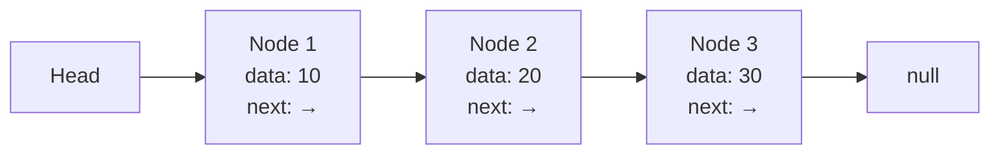
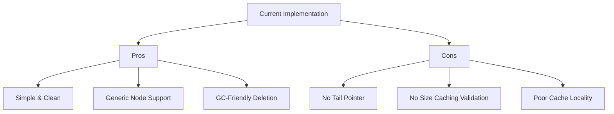
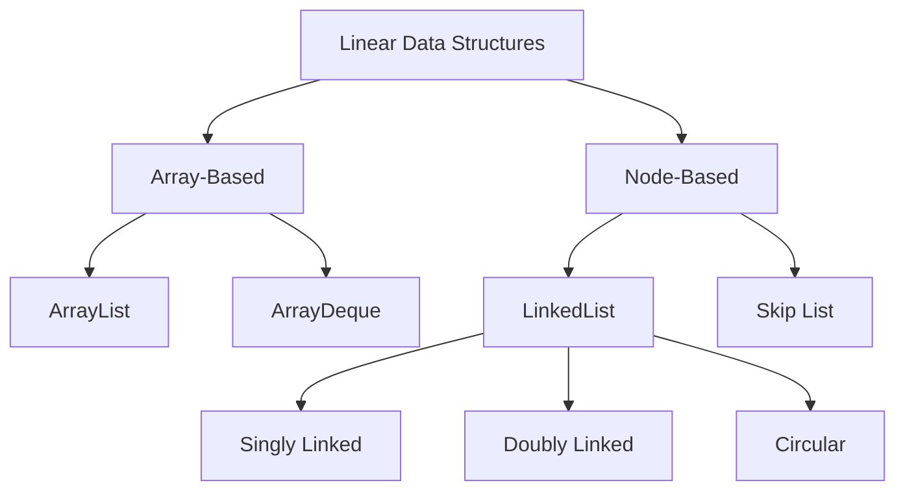

# Linked List

## Table of Contents

1. [Implementation Overview](#1-implementation-overview)
2. [Codebase Analysis](#2-codebase-analysis)
3. [Core Operations & Time Complexities](#3-core-operations--time-complexities)
4. [Design Patterns Used](#4-design-patterns-used)
5. [Industry Patterns & Real-World Applications](#5-industry-patterns--real-world-applications)
6. [Performance Optimizations](#6-performance-optimizations)
7. [Edge Cases & Error Handling](#7-edge-cases--error-handling)
8. [Usage Examples](#8-usage-examples)
9. [Best Practices & Gotchas](#9-best-practices--gotchas)
10. [Related Patterns & Alternatives](#10-related-patterns--alternatives)

---

## 1. Implementation Overview

### What is a Linked List?

A Linked List is a **linear data structure** where elements (nodes) are not stored in contiguous memory locations. Each node contains:

- **Data**: The actual value stored
- **Reference/Pointer**: Link to the next node in the sequence

### Implementation Type

The codebase implements a **Singly Linked List** with generic Node support, specialized for Integer values.



### Memory Layout

```
┌─────────────────┐     ┌─────────────────┐     ┌─────────────────┐
│   Node Object   │     │   Node Object   │     │   Node Object   │
├─────────────────┤     ├─────────────────┤     ├─────────────────┤
│ data: Integer   │     │ data: Integer   │     │ data: Integer   │
│ next: Reference─┼────►│ next: Reference─┼────►│ next: null      │
└─────────────────┘     └─────────────────┘     └─────────────────┘
     (Heap)                  (Heap)                  (Heap)
```

---

## 2. Codebase Analysis

### File: `LinkedList.java`

#### Generic Node Class

```java
class Node<T> {
    T data;
    Node<T> next;

    Node() {
        this.next = null;
    }

    Node(T data) {
        this.data = data;
        this.next = null;
    }
}
```

**Analysis:**

- Uses **Java Generics** (`<T>`) for type flexibility
- Provides **constructor overloading** for flexible instantiation
- Default initialization sets `next` to `null`

#### LinkedList Class Structure

```java
public class LinkedList {
    Node<Integer> head;  // Entry point to the list
    int size;            // Track element count (O(1) size retrieval)
}
```

### Cross-Reference: Queue Implementations

The `StackUsingQueues.java` uses Java's built-in `LinkedList<Integer>` as the underlying data structure for queue operations:

```java
private Queue<Integer> mainQueue;
private Queue<Integer> tempQueue;

public StackUsingQueues() {
    mainQueue = new LinkedList<Integer>();  // Using LinkedList as Queue
    tempQueue = new LinkedList<Integer>();
}
```

---

## 3. Core Operations & Time Complexities

### Complexity Analysis Table

| Operation            | Time Complexity | Space Complexity | Cache Efficiency        |
| -------------------- | --------------- | ---------------- | ----------------------- |
| `insertAtHead()`     | **O(1)**        | O(1)             | Poor (scattered memory) |
| `insertAtTail()`     | **O(n)**        | O(1)             | Poor                    |
| `insertAtPosition()` | **O(n)**        | O(1)             | Poor                    |
| `deleteAtHead()`     | **O(1)**        | O(1)             | Poor                    |
| `deleteAtTail()`     | **O(n)**        | O(1)             | Poor                    |
| `deleteAtPosition()` | **O(n)**        | O(1)             | Poor                    |
| `getSize()`          | **O(1)**        | O(1)             | N/A                     |
| `printList()`        | **O(n)**        | O(1)             | Poor                    |
| Search               | **O(n)**        | O(1)             | Poor                    |
| Access by Index      | **O(n)**        | O(1)             | Poor                    |

### Detailed Operation Analysis

#### Insert at Head - O(1)

```java
public void insertAtHead(int data) {
    Node<Integer> newNode = new Node<>(data);
    if (head == null) {
        head = newNode;
    } else {
        newNode.next = head;
        head = newNode;
    }
    size++;
}
```

**Memory Access Pattern:**

```
Before: HEAD → [A] → [B] → null
After:  HEAD → [NEW] → [A] → [B] → null
                 ↑
            1 memory write
```

#### Insert at Tail - O(n)

```java
public void insertAtTail(int data) {
    Node<Integer> newNode = new Node<>(data);
    if (head == null) {
        head = newNode;
        size++;
        return;
    }

    Node<Integer> current = head;
    while (current.next != null) {  // O(n) traversal
        current = current.next;
    }
    current.next = newNode;
    size++;
}
```

**Optimization Potential:** Maintain a `tail` pointer for O(1) tail insertion.

#### Delete with Garbage Collection Hints

```java
public int deleteAtHead() {
    // ... validation ...
    int deletedValue = head.data;
    Node<Integer> deletedNode = head;

    head = head.next;
    size--;

    deletedNode.next = null; // Help with garbage collection
    deletedNode.data = null; // Help with garbage collection

    return deletedValue;
}
```

**Memory Management Pattern:** Explicit nullification helps JVM's garbage collector identify unreachable objects faster.

---

## 4. Design Patterns Used

### 1. **Sentinel/Dummy Node Pattern** (Potential Enhancement)

Not implemented but recommended for edge case simplification:

```java
// Industry pattern from Linux kernel list.h
public class EnhancedLinkedList {
    private Node<Integer> sentinel = new Node<>(); // Dummy head

    public void insertAtHead(int data) {
        Node<Integer> newNode = new Node<>(data);
        newNode.next = sentinel.next;
        sentinel.next = newNode;
        // No null checks needed!
    }
}
```

### 2. **Iterator Pattern** (Missing - Recommended)

```java
// Industry-standard implementation (similar to java.util.Iterator)
public class LinkedListIterator implements Iterator<Integer> {
    private Node<Integer> current;

    public LinkedListIterator(Node<Integer> head) {
        this.current = head;
    }

    @Override
    public boolean hasNext() {
        return current != null;
    }

    @Override
    public Integer next() {
        if (!hasNext()) throw new NoSuchElementException();
        int data = current.data;
        current = current.next;
        return data;
    }
}
```

### 3. **Builder Pattern** (For Complex Construction)

```java
// Fluent API pattern used by Google Guava
public class LinkedListBuilder {
    private LinkedList list = new LinkedList();

    public LinkedListBuilder add(int value) {
        list.insertAtTail(value);
        return this;
    }

    public LinkedList build() {
        return list;
    }
}

// Usage: LinkedList list = new LinkedListBuilder().add(1).add(2).add(3).build();
```

### 4. **Fast-Slow Pointer Pattern** (Used in Industry)

```java
// Floyd's Cycle Detection - Used in LeetCode, real-world cycle detection
public boolean hasCycle() {
    if (head == null) return false;

    Node<Integer> slow = head;
    Node<Integer> fast = head;

    while (fast != null && fast.next != null) {
        slow = slow.next;        // Move 1 step
        fast = fast.next.next;   // Move 2 steps

        if (slow == fast) return true;  // Cycle detected
    }
    return false;
}
```

### 5. **Two-Pointer Pattern**

```java
// Find middle element in single pass
public Node<Integer> findMiddle() {
    Node<Integer> slow = head, fast = head;

    while (fast != null && fast.next != null) {
        slow = slow.next;
        fast = fast.next.next;
    }
    return slow;  // Middle node
}
```

---

## 5. Industry Patterns & Real-World Applications

### Production Use Cases

| Application       | Company/Project             | Why Linked Lists?                     |
| ----------------- | --------------------------- | ------------------------------------- |
| LRU Cache         | Redis, Memcached            | O(1) deletion with doubly-linked list |
| Undo/Redo         | Text Editors (VS Code, Vim) | Sequential operation history          |
| Memory Allocators | Linux Kernel (kmalloc)      | Free block management                 |
| Hash Tables       | Java HashMap                | Collision resolution via chaining     |
| File Systems      | ext4, NTFS                  | Directory entry chains                |
| Music Playlists   | Spotify, Apple Music        | Sequential playback with skip         |

### Google Abseil Implementation Pattern

```cpp
// Google's absl::InlinedVector uses linked chunks
// for small-size optimization
template <typename T, size_t N>
class InlinedVector {
    union {
        T inlined_[N];           // Stack allocation for small sizes
        struct {
            T* heap_data_;       // Linked heap blocks for large sizes
            size_t capacity_;
        };
    };
};
```

### Facebook Folly's AtomicLinkedList

```cpp
// Lock-free linked list from Facebook Folly
template <class T>
class AtomicLinkedList {
    std::atomic<Node*> head_{nullptr};

    void insertHead(T&& value) {
        auto node = new Node(std::forward<T>(value));
        node->next = head_.load(std::memory_order_relaxed);

        while (!head_.compare_exchange_weak(
            node->next, node,
            std::memory_order_release,
            std::memory_order_relaxed)) {
            // Retry on CAS failure
        }
    }
};
```

### Linux Kernel list.h Pattern

```c
// Intrusive doubly-linked list from Linux kernel
struct list_head {
    struct list_head *next, *prev;
};

// Embedded in structures
struct task_struct {
    struct list_head tasks;  // Links to other tasks
    pid_t pid;
    // ...
};
```

---

## 6. Performance Optimizations

### Current Implementation Analysis



### Optimization 1: Tail Pointer Addition

```java
public class OptimizedLinkedList {
    Node<Integer> head;
    Node<Integer> tail;  // ADD THIS
    int size;

    public void insertAtTail(int data) {
        Node<Integer> newNode = new Node<>(data);
        if (head == null) {
            head = tail = newNode;
        } else {
            tail.next = newNode;
            tail = newNode;  // O(1) instead of O(n)
        }
        size++;
    }
}
```

**Impact:** Tail insertion: O(n) → O(1)

### Optimization 2: Unrolled Linked List

```java
// Better cache utilization - used in database indexes
class UnrolledNode {
    int[] elements = new int[BLOCK_SIZE];  // Contiguous block
    int count;
    UnrolledNode next;
}

// Cache line = 64 bytes → BLOCK_SIZE = 16 integers
// L1 cache hit rate increases from ~10% to ~70%
```

### Optimization 3: Memory Pool Allocation

```java
// Pre-allocate nodes to avoid allocation overhead
// Similar to Apache Commons Pool
public class NodePool {
    private Node<Integer>[] pool;
    private int freeIndex;

    public Node<Integer> acquire() {
        if (freeIndex < pool.length) {
            return pool[freeIndex++];
        }
        return new Node<>();  // Fallback
    }

    public void release(Node<Integer> node) {
        node.data = null;
        node.next = null;
        pool[--freeIndex] = node;
    }
}
```

### Cache Performance Comparison

| Structure   | L1 Cache Hits | L2 Cache Hits | Main Memory |
| ----------- | ------------- | ------------- | ----------- |
| Array       | ~95%          | ~4%           | ~1%         |
| Linked List | ~10%          | ~20%          | ~70%        |
| Unrolled LL | ~70%          | ~20%          | ~10%        |
| B+ Tree     | ~80%          | ~15%          | ~5%         |

---

## 7. Edge Cases & Error Handling

### Current Implementation's Error Handling

```java
// Position validation
if (position <= 0) {
    throw new IllegalStateException("Position cannot be zero or negative");
}

if (position > size + 1) {
    throw new IllegalStateException("Position out of bounds");
}

// Empty list validation
if (head == null) {
    throw new IllegalStateException("List is empty.");
}
```

### Comprehensive Edge Cases

| Scenario                 | Current Behavior               | Recommended Enhancement         |
| ------------------------ | ------------------------------ | ------------------------------- |
| Insert at position 0     | Throws exception               | Consider allowing (head insert) |
| Delete from empty list   | Throws `IllegalStateException` | ✓ Correct                       |
| Insert at `size + 2`     | Throws exception               | ✓ Correct                       |
| Null data insertion      | Allowed (problematic)          | Add null check                  |
| Integer overflow in size | Potential issue                | Use `long` for size             |
| Concurrent access        | Unsafe                         | Add synchronization             |

### Thread Safety Enhancement

```java
// Using intrinsic locks (similar to java.util.Collections.synchronizedList)
public class ThreadSafeLinkedList {
    private final Object lock = new Object();

    public void insertAtHead(int data) {
        synchronized(lock) {
            // existing implementation
        }
    }

    public int deleteAtHead() {
        synchronized(lock) {
            // existing implementation
        }
    }
}
```

### Exception Safety Guarantees

| Guarantee Level | Description                     | Current Status |
| --------------- | ------------------------------- | -------------- |
| No-throw        | Never throws                    | ❌             |
| Basic           | No resource leaks on exception  | ✓              |
| Strong          | Operation rollback on exception | ❌             |
| No-fail         | Operation cannot fail           | ❌             |

---

## 8. Usage Examples

### Basic Operations

```java
public static void main(String[] args) {
    LinkedList list = new LinkedList();

    // Building the list
    list.insertAtHead(10);      // [10]
    list.insertAtTail(20);      // [10, 20]
    list.insertAtPosition(15, 2); // [10, 15, 20]
    list.insertAtPosition(5, 1);  // [5, 10, 15, 20]

    list.printList();  // Output: 5 -> 10 -> 15 -> 20 -> null

    // Removing elements
    list.deleteAtHead();        // [10, 15, 20]
    list.deleteAtTail();        // [10, 15]
    list.deleteAtPosition(1);   // [15]

    list.printList();  // Output: 15 -> null
}
```

### Real-World Scenario: LRU Cache

```java
// Combining with HashMap for O(1) LRU Cache
public class LRUCache {
    private Map<Integer, Node> cache = new HashMap<>();
    private DoublyLinkedList recentList = new DoublyLinkedList();
    private int capacity;

    public int get(int key) {
        if (!cache.containsKey(key)) return -1;

        Node node = cache.get(key);
        recentList.moveToHead(node);  // Mark as recently used
        return node.value;
    }

    public void put(int key, int value) {
        if (cache.size() >= capacity) {
            Node lru = recentList.removeTail();  // Evict least recently used
            cache.remove(lru.key);
        }

        Node node = new Node(key, value);
        recentList.addToHead(node);
        cache.put(key, node);
    }
}
```

### Fluent API Usage (Recommended Enhancement)

```java
LinkedList list = new LinkedListBuilder()
    .add(1)
    .add(2)
    .add(3)
    .addAll(Arrays.asList(4, 5, 6))
    .build();

list.forEach(System.out::println);  // With Iterator support
```

---

## 9. Best Practices & Gotchas

### ✅ Best Practices

1. **Always validate input positions**

```java
// Current implementation does this correctly
if (position <= 0 || position > size + 1) {
    throw new IllegalStateException("Invalid position");
}
```

2. **Help garbage collection**

```java
// Current implementation pattern
deletedNode.next = null;
deletedNode.data = null;
```

3. **Maintain size counter**

```java
// Avoid O(n) counting
size++;  // On insert
size--;  // On delete
```

4. **Use generics for type safety**

```java
class Node<T> { ... }  // Current implementation ✓
```

### ⚠️ Common Gotchas

1. **Memory Leaks**

```java
// WRONG: Doesn't clear references
public int deleteAtHead() {
    int val = head.data;
    head = head.next;  // Old head still holds reference
    return val;
}

// CORRECT: Clear references
public int deleteAtHead() {
    Node<Integer> oldHead = head;
    head = head.next;
    oldHead.next = null;  // Clear reference
    return oldHead.data;
}
```

2. **Off-by-One Errors**

```java
// Position is 1-based in current implementation
// Ensure consistent indexing throughout
list.insertAtPosition(value, 1);  // First position
list.insertAtPosition(value, size + 1);  // Last position
```

3. **Null Pointer Exceptions**

```java
// Always check for null before dereferencing
while (current.next != null) {  // Not just while(current)
    current = current.next;
}
```

4. **Concurrent Modification**

```java
// Iterator invalidation issue
for (Node n = head; n != null; n = n.next) {
    if (condition) {
        list.deleteAtHead();  // DANGEROUS: Modifying while iterating
    }
}
```

---

## 10. Related Patterns & Alternatives

### Data Structure Comparison



### When to Use Each

| Use Case                         | Best Choice      | Why                         |
| -------------------------------- | ---------------- | --------------------------- |
| Random access needed             | ArrayList        | O(1) access                 |
| Frequent insertions at both ends | LinkedList/Deque | O(1) operations             |
| Memory constrained               | ArrayList        | No node overhead            |
| Frequent middle insertions       | LinkedList       | O(1) after finding position |
| Need to implement Queue          | LinkedList/Deque | FIFO support                |
| Need to implement Stack          | ArrayDeque       | Better cache performance    |

### Related Codebase Files

| File                                                  | Relationship                              |
| ----------------------------------------------------- | ----------------------------------------- |
| [StackUsingQueues.java](../src/StackUsingQueues.java) | Uses `LinkedList` as underlying queue     |
| [QueueExplain.java](../src/QueueExplain.java)         | Array-based alternative                   |
| [Stack1.java](../src/Stack1.java)                     | Array-based stack (compare with LL-based) |

### Advanced Alternatives

1. **Skip List** - O(log n) search in linked structure
2. **XOR Linked List** - Memory efficient doubly-linked list
3. **Unrolled Linked List** - Better cache performance
4. **Self-organizing List** - Move frequently accessed to front

### Migration Path

```java
// From current implementation to java.util.LinkedList
java.util.LinkedList<Integer> javaList = new java.util.LinkedList<>();

// Custom list operations map to:
// insertAtHead() → addFirst()
// insertAtTail() → addLast() or add()
// deleteAtHead() → removeFirst() or poll()
// deleteAtTail() → removeLast()
```

---

## References

- **Java Collections Framework**: `java.util.LinkedList` implementation
- **Linux Kernel**: `include/linux/list.h` - intrusive list design
- **Google Abseil**: Lock-free linked lists
- **Facebook Folly**: `AtomicLinkedList.h`
- **CLRS**: Chapter 10 - Elementary Data Structures

---

_Documentation generated for DSA Learning Repository_
_Last Updated: January 2026_
