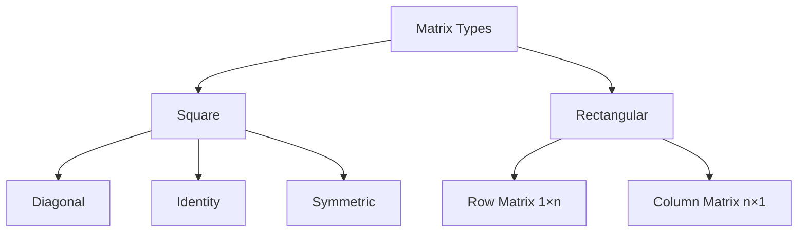
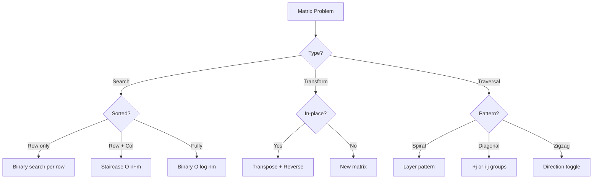

# Matrix Operations

## Table of Contents

1. [Implementation Overview](#1-implementation-overview)
2. [Codebase Analysis](#2-codebase-analysis)
3. [Core Operations & Time Complexities](#3-core-operations--time-complexities)
4. [Design Patterns Used](#4-design-patterns-used)
5. [Industry Patterns & Real-World Applications](#5-industry-patterns--real-world-applications)
6. [Performance Optimizations](#6-performance-optimizations)
7. [Edge Cases & Error Handling](#7-edge-cases--error-handling)
8. [Usage Examples](#8-usage-examples)
9. [Best Practices & Gotchas](#9-best-practices--gotchas)
10. [Related Patterns & Alternatives](#10-related-patterns--alternatives)

---

## 1. Implementation Overview

### What is a Matrix?

A matrix is a 2D data structure consisting of rows and columns. In programming, it's typically represented as a 2D array where `matrix[i][j]` accesses the element at row `i` and column `j`.

### Memory Layout

```
Logical View:          Memory Layout (Row-Major):
┌─────────────────┐    ┌───┬───┬───┬───┬───┬───┬───┬───┬───┐
│  1  │  2  │  3  │    │ 1 │ 2 │ 3 │ 4 │ 5 │ 6 │ 7 │ 8 │ 9 │
├─────┼─────┼─────┤    └───┴───┴───┴───┴───┴───┴───┴───┴───┘
│  4  │  5  │  6  │     ↑       ↑           ↑
├─────┼─────┼─────┤    row 0   row 1       row 2
│  7  │  8  │  9  │
└─────┴─────┴─────┘

Address of [i][j] = base + (i × cols + j) × element_size
```

### Matrix Types



### Codebase Coverage

| File                  | Algorithm            | Description                  |
| --------------------- | -------------------- | ---------------------------- |
| `MatrixProblem1.java` | Median in Row-Sorted | Binary search + counting     |
| `MatrixProblem2.java` | K-th Smallest        | Binary search on value range |
| `MatrixProblem3.java` | Search in 2D Matrix  | Staircase search             |
| `MatrixProblem4.java` | Transpose & Rotate   | In-place transformation      |
| `MatrixProblem5.java` | Spiral Traversal     | Layer-by-layer spiral        |
| `MatrixProblem6.java` | Set Matrix Zeroes    | Optimal space marking        |

---

## 2. Codebase Analysis

### Median in Row-wise Sorted Matrix (`MatrixProblem1.java`)

```java
static int matrixMedian(int[][] arr) {
    int n = arr.length, m = arr[0].length;
    int min = Integer.MAX_VALUE, max = Integer.MIN_VALUE;

    // Find range [min, max]
    for (int i = 0; i < n; i++) {
        min = Math.min(min, arr[i][0]);
        max = Math.max(max, arr[i][m - 1]);
    }

    int desired = (n * m + 1) / 2;

    // Binary search on answer
    while (min < max) {
        int mid = min + (max - min) / 2;
        int count = countLessOrEqual(arr, mid);

        if (count < desired) {
            min = mid + 1;
        } else {
            max = mid;
        }
    }
    return min;
}

static int countLessOrEqual(int[][] arr, int target) {
    int count = 0;
    for (int i = 0; i < arr.length; i++) {
        count += upperBound(arr[i], target);
    }
    return count;
}
```

**Visualization:**

```
Matrix (row-wise sorted):
[1, 3, 5]
[2, 6, 9]
[3, 6, 9]

Total elements = 9, median position = 5

Binary search on value range [1, 9]:
mid = 5: count(≤5) = 4 → search [6, 9]
mid = 7: count(≤7) = 7 → search [6, 7]
mid = 6: count(≤6) = 6 → search [6, 6]
Median = 6
```

### K-th Smallest Element (`MatrixProblem2.java`)

```java
static int kthSmallest(int[][] arr, int k) {
    int n = arr.length;
    int min = arr[0][0];
    int max = arr[n-1][n-1];

    while (min < max) {
        int mid = min + (max - min) / 2;
        int count = countLessOrEqual(arr, mid);

        if (count < k) {
            min = mid + 1;
        } else {
            max = mid;
        }
    }
    return min;
}

static int countLessOrEqual(int[][] arr, int target) {
    int count = 0;
    int n = arr.length;
    int row = n - 1, col = 0;  // Start from bottom-left

    while (row >= 0 && col < n) {
        if (arr[row][col] <= target) {
            count += row + 1;  // All elements above are smaller
            col++;
        } else {
            row--;
        }
    }
    return count;
}
```

### Search in 2D Matrix (`MatrixProblem3.java`)

```java
// Staircase Search - O(m + n)
static boolean searchMatrix(int[][] arr, int target) {
    int n = arr.length, m = arr[0].length;
    int row = 0, col = m - 1;  // Start from top-right

    while (row < n && col >= 0) {
        if (arr[row][col] == target) {
            return true;
        } else if (arr[row][col] > target) {
            col--;  // Go left
        } else {
            row++;  // Go down
        }
    }
    return false;
}
```

**Visualization:**

```
Search for 14 in sorted matrix:
[1,  4,  7,  11, 15]
[2,  5,  8,  12, 19]
[3,  6,  9,  16, 22]
[10, 13, 14, 17, 24]
[18, 21, 23, 26, 30]

Path: 15 → 11 → 12 → 16 → 14 ✓
      ↓    ↓    ↓    ↓
     >15  <14  <14  >14  =14
```

### Transpose and Rotate (`MatrixProblem4.java`)

```java
// Transpose: Swap [i][j] with [j][i]
static void transpose(int[][] arr) {
    int n = arr.length;
    for (int i = 0; i < n; i++) {
        for (int j = i + 1; j < n; j++) {
            int temp = arr[i][j];
            arr[i][j] = arr[j][i];
            arr[j][i] = temp;
        }
    }
}

// Rotate 90° clockwise = Transpose + Reverse rows
static void rotate90Clockwise(int[][] arr) {
    transpose(arr);
    for (int[] row : arr) {
        reverse(row);
    }
}

// Rotate 90° counter-clockwise = Transpose + Reverse columns
static void rotate90CounterClockwise(int[][] arr) {
    transpose(arr);
    reverseColumns(arr);
}
```

**Visualization:**

```
Original:       Transpose:      Rotate 90° CW:
[1, 2, 3]       [1, 4, 7]       [7, 4, 1]
[4, 5, 6]  →    [2, 5, 8]   →   [8, 5, 2]
[7, 8, 9]       [3, 6, 9]       [9, 6, 3]
```

### Spiral Traversal (`MatrixProblem5.java`)

```java
static List<Integer> spiralOrder(int[][] arr) {
    List<Integer> result = new ArrayList<>();
    if (arr.length == 0) return result;

    int top = 0, bottom = arr.length - 1;
    int left = 0, right = arr[0].length - 1;

    while (top <= bottom && left <= right) {
        // Traverse right
        for (int i = left; i <= right; i++) {
            result.add(arr[top][i]);
        }
        top++;

        // Traverse down
        for (int i = top; i <= bottom; i++) {
            result.add(arr[i][right]);
        }
        right--;

        // Traverse left (if rows remain)
        if (top <= bottom) {
            for (int i = right; i >= left; i--) {
                result.add(arr[bottom][i]);
            }
            bottom--;
        }

        // Traverse up (if columns remain)
        if (left <= right) {
            for (int i = bottom; i >= top; i--) {
                result.add(arr[i][left]);
            }
            left++;
        }
    }
    return result;
}
```

**Visualization:**

```
[1,  2,  3,  4]
[5,  6,  7,  8]
[9,  10, 11, 12]
[13, 14, 15, 16]

Spiral: 1→2→3→4→8→12→16→15→14→13→9→5→6→7→11→10
```

### Set Matrix Zeroes (`MatrixProblem6.java`)

```java
static void setZeroes(int[][] arr) {
    int n = arr.length, m = arr[0].length;
    boolean firstRowZero = false, firstColZero = false;

    // Check if first row/col needs zeroing
    for (int j = 0; j < m; j++) {
        if (arr[0][j] == 0) firstRowZero = true;
    }
    for (int i = 0; i < n; i++) {
        if (arr[i][0] == 0) firstColZero = true;
    }

    // Use first row/col as markers
    for (int i = 1; i < n; i++) {
        for (int j = 1; j < m; j++) {
            if (arr[i][j] == 0) {
                arr[i][0] = 0;  // Mark row
                arr[0][j] = 0;  // Mark column
            }
        }
    }

    // Zero out based on markers
    for (int i = 1; i < n; i++) {
        for (int j = 1; j < m; j++) {
            if (arr[i][0] == 0 || arr[0][j] == 0) {
                arr[i][j] = 0;
            }
        }
    }

    // Handle first row/col
    if (firstRowZero) {
        Arrays.fill(arr[0], 0);
    }
    if (firstColZero) {
        for (int i = 0; i < n; i++) {
            arr[i][0] = 0;
        }
    }
}
```

---

## 3. Core Operations & Time Complexities

### Operation Complexity Table

| Operation        | Time   | Space  | Notes               |
| ---------------- | ------ | ------ | ------------------- |
| Access `[i][j]`  | O(1)   | O(1)   | Direct indexing     |
| Row traversal    | O(m)   | O(1)   | Single row          |
| Column traversal | O(n)   | O(1)   | Single column       |
| Full traversal   | O(n×m) | O(1)   | All elements        |
| Transpose        | O(n²)  | O(1)   | In-place for square |
| Rotate 90°       | O(n²)  | O(1)   | In-place            |
| Spiral order     | O(n×m) | O(n×m) | Output storage      |
| Set zeroes       | O(n×m) | O(1)   | Optimal             |

### Search Complexity

| Algorithm        | Matrix Type    | Time        | Space |
| ---------------- | -------------- | ----------- | ----- |
| Linear search    | Any            | O(n×m)      | O(1)  |
| Binary search    | Row-sorted     | O(n log m)  | O(1)  |
| Staircase search | Row+Col sorted | O(n+m)      | O(1)  |
| 2D binary search | Fully sorted   | O(log(n×m)) | O(1)  |

### Median/K-th Smallest

| Algorithm               | Time                      | Space       |
| ----------------------- | ------------------------- | ----------- |
| Sort all                | O(n×m log(n×m))           | O(n×m)      |
| Binary search on answer | O(n log m × log(max-min)) | O(1)        |
| Heap-based              | O(k log(min(n,m)))        | O(min(n,m)) |

---

## 4. Design Patterns Used

### 1. **Binary Search on Answer Pattern**

```java
// Used in median and k-th smallest problems
int binarySearchOnAnswer(int[][] matrix) {
    int lo = minElement, hi = maxElement;

    while (lo < hi) {
        int mid = lo + (hi - lo) / 2;
        int count = countElementsLessOrEqual(matrix, mid);

        if (count < targetPosition) {
            lo = mid + 1;
        } else {
            hi = mid;
        }
    }
    return lo;
}
```

### 2. **Staircase Search Pattern**

```java
// Start from corner, eliminate row or column
void staircaseSearch(int[][] matrix, int target) {
    int row = 0, col = matrix[0].length - 1;  // Top-right
    // OR: row = matrix.length - 1, col = 0;  // Bottom-left

    while (inBounds(row, col)) {
        if (matrix[row][col] == target) return FOUND;
        else if (matrix[row][col] > target) col--;
        else row++;
    }
    return NOT_FOUND;
}
```

### 3. **Layer-by-Layer Pattern**

```java
// Process matrix in concentric layers
void layerByLayer(int[][] matrix) {
    int top = 0, bottom = n - 1;
    int left = 0, right = m - 1;

    while (top <= bottom && left <= right) {
        processLayer(matrix, top, bottom, left, right);
        top++; bottom--; left++; right--;
    }
}
```

### 4. **In-Place Marker Pattern**

```java
// Use matrix itself to store metadata
void setZeroesOptimal(int[][] matrix) {
    // Use first row/column as markers
    boolean firstRowZero = checkFirstRow();
    boolean firstColZero = checkFirstCol();

    // Mark in first row/col
    for (i, j in matrix[1:][1:]) {
        if (matrix[i][j] == 0) {
            matrix[i][0] = 0;  // Row marker
            matrix[0][j] = 0;  // Column marker
        }
    }

    // Apply markers
    // Handle first row/col separately
}
```

### 5. **Transform Chain Pattern**

```java
// Rotate = Transpose + Reverse
void rotate90Clockwise(int[][] matrix) {
    transpose(matrix);
    reverseRows(matrix);
}

void rotate90CounterClockwise(int[][] matrix) {
    transpose(matrix);
    reverseColumns(matrix);
}

void rotate180(int[][] matrix) {
    reverseRows(matrix);
    reverseColumns(matrix);
}
```

---

## 5. Industry Patterns & Real-World Applications

### Image Processing

```java
// Grayscale image rotation
BufferedImage rotateImage(BufferedImage image, int degrees) {
    int[][] pixels = imageToMatrix(image);

    switch (degrees) {
        case 90: rotate90Clockwise(pixels); break;
        case 180: rotate180(pixels); break;
        case 270: rotate90CounterClockwise(pixels); break;
    }

    return matrixToImage(pixels);
}

// Blur filter (convolution)
int[][] blur(int[][] image) {
    int[][] kernel = {{1,1,1}, {1,1,1}, {1,1,1}};
    return convolve(image, kernel, 9);  // Divide by 9
}
```

### Game Development

```java
// 2D tile map collision detection
class TileMap {
    int[][] tiles;  // 0 = walkable, 1 = wall

    boolean canMoveTo(int x, int y) {
        if (outOfBounds(x, y)) return false;
        return tiles[y][x] == 0;
    }

    // Pathfinding uses matrix traversal
    List<Point> findPath(Point start, Point end) {
        return aStar(tiles, start, end);
    }
}
```

### Spreadsheet Operations

```java
// Excel-like operations
class Spreadsheet {
    Object[][] cells;

    // Range operations use submatrix
    double sum(String range) {  // "A1:C3"
        int[][] coords = parseRange(range);
        double sum = 0;
        for (int i = coords[0][0]; i <= coords[1][0]; i++) {
            for (int j = coords[0][1]; j <= coords[1][1]; j++) {
                sum += getNumericValue(cells[i][j]);
            }
        }
        return sum;
    }
}
```

### Database Storage

```java
// Column-store vs Row-store
// Row-major (good for OLTP - entire row access)
Object[][] rowStore;  // Each row is a record

// Column-major (good for OLAP - aggregations)
Object[][] colStore;  // Each column is a field

// Sparse matrix storage (for mostly zero data)
class SparseMatrix {
    Map<Long, Integer> data;  // key = row * cols + col

    int get(int row, int col) {
        return data.getOrDefault(key(row, col), 0);
    }
}
```

### Machine Learning

```java
// Matrix multiplication (neural networks)
double[][] matmul(double[][] A, double[][] B) {
    int m = A.length, n = A[0].length, p = B[0].length;
    double[][] C = new double[m][p];

    for (int i = 0; i < m; i++) {
        for (int j = 0; j < p; j++) {
            for (int k = 0; k < n; k++) {
                C[i][j] += A[i][k] * B[k][j];
            }
        }
    }
    return C;
}
```

---

## 6. Performance Optimizations

### Optimization 1: Cache-Friendly Access

```java
// BAD: Column-major access (cache unfriendly in Java)
for (int j = 0; j < cols; j++) {
    for (int i = 0; i < rows; i++) {
        sum += matrix[i][j];  // Jumps in memory
    }
}

// GOOD: Row-major access (cache friendly)
for (int i = 0; i < rows; i++) {
    for (int j = 0; j < cols; j++) {
        sum += matrix[i][j];  // Sequential memory access
    }
}

// Cache performance improvement: 2-10x faster
```

### Optimization 2: Loop Tiling (Blocking)

```java
// Matrix multiplication with tiling
static final int TILE_SIZE = 32;  // Cache line size

void matmulTiled(double[][] A, double[][] B, double[][] C) {
    int n = A.length;

    for (int i0 = 0; i0 < n; i0 += TILE_SIZE) {
        for (int j0 = 0; j0 < n; j0 += TILE_SIZE) {
            for (int k0 = 0; k0 < n; k0 += TILE_SIZE) {
                // Process tile
                for (int i = i0; i < Math.min(i0 + TILE_SIZE, n); i++) {
                    for (int j = j0; j < Math.min(j0 + TILE_SIZE, n); j++) {
                        for (int k = k0; k < Math.min(k0 + TILE_SIZE, n); k++) {
                            C[i][j] += A[i][k] * B[k][j];
                        }
                    }
                }
            }
        }
    }
}
```

### Optimization 3: Early Termination

```java
// Search with early exit
boolean containsZero(int[][] matrix) {
    for (int[] row : matrix) {
        for (int val : row) {
            if (val == 0) return true;  // Exit early
        }
    }
    return false;
}
```

### Optimization 4: Parallel Processing

```java
// Parallel row processing
void parallelSum(int[][] matrix) {
    int[] rowSums = new int[matrix.length];

    IntStream.range(0, matrix.length)
        .parallel()
        .forEach(i -> {
            rowSums[i] = Arrays.stream(matrix[i]).sum();
        });

    return Arrays.stream(rowSums).sum();
}
```

### Optimization 5: Flat Array Representation

```java
// 2D array (indirection, cache misses)
int[][] matrix = new int[n][m];
int val = matrix[i][j];

// Flat 1D array (better cache performance)
int[] flatMatrix = new int[n * m];
int val = flatMatrix[i * m + j];

// 10-30% faster for large matrices
```

---

## 7. Edge Cases & Error Handling

### Edge Cases

| Case               | Handling             |
| ------------------ | -------------------- |
| Empty matrix       | Return empty/default |
| Single row         | Handle as 1D array   |
| Single column      | Handle specially     |
| 1×1 matrix         | Direct return        |
| Non-square matrix  | Check dimensions     |
| Negative values    | Consider in range    |
| All same values    | Median/search edge   |
| Sorted vs unsorted | Algorithm selection  |

### Input Validation

```java
static void validateMatrix(int[][] matrix) {
    if (matrix == null || matrix.length == 0) {
        throw new IllegalArgumentException("Matrix cannot be null or empty");
    }

    int cols = matrix[0].length;
    for (int i = 1; i < matrix.length; i++) {
        if (matrix[i].length != cols) {
            throw new IllegalArgumentException("Jagged arrays not supported");
        }
    }
}

static void validateSquare(int[][] matrix) {
    validateMatrix(matrix);
    if (matrix.length != matrix[0].length) {
        throw new IllegalArgumentException("Matrix must be square");
    }
}
```

### Bounds Checking

```java
static boolean isValidPosition(int[][] matrix, int row, int col) {
    return row >= 0 && row < matrix.length &&
           col >= 0 && col < matrix[0].length;
}

static int safeGet(int[][] matrix, int row, int col, int defaultVal) {
    if (isValidPosition(matrix, row, col)) {
        return matrix[row][col];
    }
    return defaultVal;
}
```

### Integer Overflow

```java
// Careful with index calculations
// WRONG: Can overflow
int index = row * cols + col;  // May overflow if row, cols large

// RIGHT: Check bounds first
if (row >= 0 && row < rows && col >= 0 && col < cols) {
    long index = (long) row * cols + col;  // Use long
    if (index <= Integer.MAX_VALUE) {
        // Safe to use
    }
}
```

---

## 8. Usage Examples

### Matrix Search

```java
int[][] matrix = {
    {1,  4,  7,  11, 15},
    {2,  5,  8,  12, 19},
    {3,  6,  9,  16, 22},
    {10, 13, 14, 17, 24},
    {18, 21, 23, 26, 30}
};

// Staircase search
boolean found = searchMatrix(matrix, 14);  // true
found = searchMatrix(matrix, 20);  // false
```

### Spiral Traversal

```java
int[][] matrix = {
    {1, 2, 3, 4},
    {5, 6, 7, 8},
    {9, 10, 11, 12}
};

List<Integer> spiral = spiralOrder(matrix);
// Result: [1, 2, 3, 4, 8, 12, 11, 10, 9, 5, 6, 7]
```

### Matrix Rotation

```java
int[][] matrix = {
    {1, 2, 3},
    {4, 5, 6},
    {7, 8, 9}
};

rotate90Clockwise(matrix);
// Result:
// [7, 4, 1]
// [8, 5, 2]
// [9, 6, 3]
```

### Set Zeroes

```java
int[][] matrix = {
    {1, 1, 1},
    {1, 0, 1},
    {1, 1, 1}
};

setZeroes(matrix);
// Result:
// [1, 0, 1]
// [0, 0, 0]
// [1, 0, 1]
```

### Median Finding

```java
int[][] matrix = {
    {1, 3, 5},
    {2, 6, 9},
    {3, 6, 9}
};

int median = matrixMedian(matrix);  // 5
```

---

## 9. Best Practices & Gotchas

### ✅ Best Practices

1. **Choose right algorithm for matrix type**

```java
// Row-sorted only → Binary search per row
// Row + Column sorted → Staircase search
// Fully sorted (row-major) → Single binary search
```

2. **Use row-major traversal for cache efficiency**

```java
// Process rows, not columns
for (int i = 0; i < n; i++) {
    for (int j = 0; j < m; j++) {
        process(matrix[i][j]);
    }
}
```

3. **Validate matrix properties before operations**

```java
void rotate90(int[][] matrix) {
    if (matrix.length != matrix[0].length) {
        throw new IllegalArgumentException("In-place rotation requires square matrix");
    }
    // ... rotation logic
}
```

4. **Use descriptive indices**

```java
// Good
int row = i, col = j;
matrix[row][col] = value;

// Bad
matrix[i][j] = value;  // Less clear context
```

### ⚠️ Common Gotchas

1. **Confusing rows and columns**

```java
// WRONG: Using i for column, j for row
for (int i = 0; i < cols; i++) {
    for (int j = 0; j < rows; j++) {
        matrix[i][j];  // ArrayIndexOutOfBoundsException!
    }
}

// RIGHT: i for row, j for column
for (int i = 0; i < rows; i++) {
    for (int j = 0; j < cols; j++) {
        matrix[i][j];  // Correct
    }
}
```

2. **Modifying during iteration**

```java
// WRONG: Set zeroes while scanning
for (int i = 0; i < n; i++) {
    for (int j = 0; j < m; j++) {
        if (matrix[i][j] == 0) {
            zeroRow(matrix, i);  // Affects later checks!
        }
    }
}

// RIGHT: Collect positions first, then modify
List<int[]> zeros = new ArrayList<>();
// ... collect zero positions
for (int[] pos : zeros) {
    zeroRow(matrix, pos[0]);
    zeroCol(matrix, pos[1]);
}
```

3. **Shallow copy of 2D arrays**

```java
// WRONG: Shallow copy
int[][] copy = matrix.clone();  // Only copies row references!

// RIGHT: Deep copy
int[][] copy = new int[n][m];
for (int i = 0; i < n; i++) {
    copy[i] = matrix[i].clone();
}
```

4. **Off-by-one in boundary conditions**

```java
// WRONG: Incorrect bounds in staircase search
while (row >= 0 && col < m)  // Should check both bounds

// RIGHT
while (row >= 0 && row < n && col >= 0 && col < m)
```

5. **Spiral traversal direction**

```java
// Order matters!
// Right → Down → Left → Up (clockwise from top-left)
// Down → Right → Up → Left (clockwise from top-right)

// Always check boundary conditions before each direction
```

---

## 10. Related Patterns & Alternatives

### Related Codebase Files

| File                                                       | Relationship                  |
| ---------------------------------------------------------- | ----------------------------- |
| [BinarySearch\*.java](../src/BinarySearch1.java)           | Used in matrix search/median  |
| [SortingAlgorithms\*.java](../src/SortingAlgorithms1.java) | Sorting for matrix operations |

### Algorithm Selection Guide



### Java Library Support

```java
// Arrays utilities
int[][] copy = Arrays.copyOf(matrix, matrix.length);
Arrays.fill(row, 0);
Arrays.sort(row);

// Stream operations
int sum = Arrays.stream(matrix)
    .flatMapToInt(Arrays::stream)
    .sum();

// Matrix libraries (external)
// Apache Commons Math: RealMatrix
// EJML: DenseMatrix
// ND4J: INDArray (for deep learning)
```

### Alternative Data Structures

| Structure      | Use Case             | Trade-off         |
| -------------- | -------------------- | ----------------- |
| 1D flat array  | Cache performance    | Index calculation |
| Sparse matrix  | Mostly zeros         | Lookup overhead   |
| Block matrix   | Large matrices       | Complexity        |
| COO/CSR format | Scientific computing | Specialized ops   |

---

## References

- **CLRS**: Chapter 28 (Matrix Operations)
- **Numerical Recipes**: Matrix algorithms
- **Intel MKL**: Optimized matrix operations
- **LeetCode**: Matrix problem patterns

---

_Documentation generated for DSA Learning Repository_
_Last Updated: January 2026_
