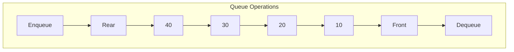
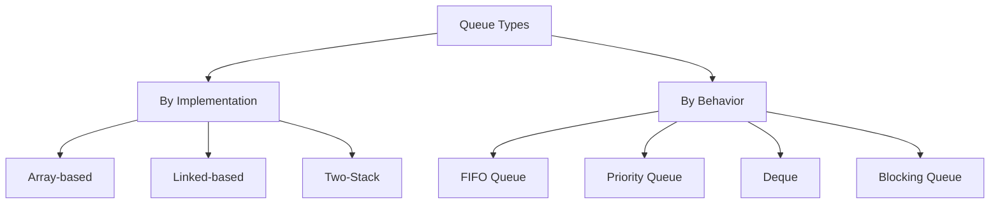

# Queue

## Table of Contents

1. [Implementation Overview](#1-implementation-overview)
2. [Codebase Analysis](#2-codebase-analysis)
3. [Core Operations & Time Complexities](#3-core-operations--time-complexities)
4. [Design Patterns Used](#4-design-patterns-used)
5. [Industry Patterns & Real-World Applications](#5-industry-patterns--real-world-applications)
6. [Performance Optimizations](#6-performance-optimizations)
7. [Edge Cases & Error Handling](#7-edge-cases--error-handling)
8. [Usage Examples](#8-usage-examples)
9. [Best Practices & Gotchas](#9-best-practices--gotchas)
10. [Related Patterns & Alternatives](#10-related-patterns--alternatives)

---

## 1. Implementation Overview

### What is a Queue?

A Queue is a **linear data structure** that follows the **FIFO (First In First Out)** principle. Elements are added at the rear and removed from the front.



### Visual Representation

```
                    ENQUEUE                    DEQUEUE
                       ↓                          ↓
    ┌─────────────────────────────────────────────────┐
    │  REAR → [40] [30] [20] [10] → FRONT             │
    └─────────────────────────────────────────────────┘
                   ←──────────────→
                   Processing Direction (FIFO)
```

### Codebase Implementations

| File                    | Type           | Description                      |
| ----------------------- | -------------- | -------------------------------- |
| `QueueExplain.java`     | Linear Queue   | Basic array-based implementation |
| `QueueCircular.java`    | Circular Queue | Efficient space utilization      |
| `QueueDoubleEnded.java` | Deque          | Double-ended queue (both ends)   |
| `QueueUsingStack.java`  | Stack-based    | Queue using two stacks           |

---

## 2. Codebase Analysis

### Implementation 1: Linear Queue (`QueueExplain.java`)

```java
public class QueueExplain {
    int rear;
    int front;
    int size;
    int capacity;
    int queue[];

    public QueueExplain(int capacity) {
        queue = new int[capacity];
        this.capacity = capacity;
        size = 0;
        rear = front = -1;
    }
}
```

#### Core Operations

```java
public void enqueue(int val) {
    if (isFull()) {
        throw new IllegalStateException("Queue is Full");
    }
    if (isEmpty()) {
        front = 0;
    }
    queue[++rear] = val;
}

public int dequeue() {
    if (isEmpty()) {
        throw new IllegalStateException("Queue is Empty.");
    }
    int val = queue[front];
    if (front == rear) {
        front = -1;
        rear = -1;
    } else {
        front++;
    }
    return val;
}
```

**Problem:** Space wasted after dequeue operations (front moves forward, can't reuse space).

### Implementation 2: Circular Queue (`QueueCircular.java`)

```java
public class QueueCircular {
    int rear, front, size, capacity;
    int queue[];

    public QueueCircular(int capacity) {
        queue = new int[capacity];
        this.capacity = capacity;
        size = 0;
        rear = front = -1;
    }
}
```

#### Circular Operations

```java
public void enqueue(int val) {
    if (isFull()) {
        throw new IllegalStateException("Queue is Full");
    }
    if (isEmpty()) {
        front = 0;
    }
    rear = (rear + 1) % capacity;  // Circular increment
    queue[rear] = val;
    size++;
}

public int dequeue() {
    if (isEmpty()) {
        throw new IllegalStateException("Queue is Empty.");
    }
    int val = queue[front];
    if (front == rear) {
        front = -1;
        rear = -1;
        size = 0;
    } else {
        front = (front + 1) % capacity;  // Circular increment
        size--;
    }
    return val;
}

public boolean isFull() {
    return size == capacity;  // Size-based check
}
```

**Visualization:**

```
Linear Queue (wasted space):
┌───┬───┬───┬───┬───┐
│ X │ X │ 3 │ 4 │ 5 │  After 2 dequeues, slots 0-1 are unusable
└───┴───┴───┴───┴───┘
      ↑           ↑
    front       rear

Circular Queue (reuses space):
┌───┬───┬───┬───┬───┐
│ 6 │ 7 │ 3 │ 4 │ 5 │  Wraps around, reuses slots 0-1
└───┴───┴───┴───┴───┘
      ↑       ↑
    rear    front
```

### Implementation 3: Double-Ended Queue (`QueueDoubleEnded.java`)

```java
public class QueueDoubleEnded {
    // Same structure as circular queue

    public void enqueueRear(int val) {
        if (isFull()) throw new IllegalStateException("Queue is Full");
        if (isEmpty()) front = 0;
        rear = (rear + 1) % capacity;
        queue[rear] = val;
        size++;
    }

    public void enqueueFront(int val) {
        if (isFull()) throw new IllegalStateException("Queue is Full");
        if (isEmpty()) {
            front = 0;
            rear = 0;
        } else {
            front = (front - 1 + capacity) % capacity;  // Circular decrement
        }
        queue[front] = val;
        size++;
    }

    public int dequeueFront() {
        if (isEmpty()) throw new IllegalStateException("Queue is Empty.");
        int val = queue[front];
        if (front == rear) {
            front = rear = -1;
            size = 0;
        } else {
            front = (front + 1) % capacity;
        }
        return val;
    }

    public int dequeueRear() {
        if (isEmpty()) throw new IllegalStateException("Queue is Empty.");
        int val = queue[rear];
        if (front == rear) {
            front = rear = -1;
            size = 0;
        } else {
            rear = (rear - 1 + capacity) % capacity;  // Circular decrement
        }
        return val;
    }
}
```

### Implementation 4: Queue Using Stacks (`QueueUsingStack.java`)

```java
public class QueueUsingStack {
    Stack<Integer> stack = new Stack<>();
    Stack<Integer> reverseStack = new Stack<>();

    // Method 1: O(1) enqueue, O(n) dequeue
    public void enqueue(int val) {
        stack.push(val);
    }

    public int dequeue() {
        if (stack.isEmpty()) {
            throw new IllegalStateException("Queue is Empty");
        }
        // Transfer all to reverse stack
        while (!stack.isEmpty()) {
            reverseStack.push(stack.pop());
        }
        int val = reverseStack.pop();
        // Transfer back
        while (!reverseStack.isEmpty()) {
            stack.push(reverseStack.pop());
        }
        return val;
    }

    // Method 2: O(n) enqueue, O(1) dequeue
    public void enqueueV2(int val) {
        if (stack.isEmpty()) {
            stack.push(val);
        } else {
            // Transfer all to reverse, push, transfer back
            while (!stack.isEmpty()) {
                reverseStack.push(stack.pop());
            }
            stack.push(val);
            while (!reverseStack.isEmpty()) {
                stack.push(reverseStack.pop());
            }
        }
    }

    public int dequeueV2() {
        if (stack.isEmpty()) {
            throw new IllegalStateException("Queue is Empty");
        }
        return stack.pop();
    }
}
```

---

## 3. Core Operations & Time Complexities

### Complexity Comparison Table

| Operation   | Linear Queue | Circular Queue     | Deque    | Two-Stack Queue |
| ----------- | ------------ | ------------------ | -------- | --------------- |
| `enqueue()` | **O(1)**     | **O(1)**           | **O(1)** | O(1) or O(n)\*  |
| `dequeue()` | **O(1)**     | **O(1)**           | **O(1)** | O(n) or O(1)\*  |
| `peek()`    | **O(1)**     | **O(1)**           | **O(1)** | O(n) or O(1)\*  |
| `isEmpty()` | **O(1)**     | **O(1)**           | **O(1)** | O(1)            |
| `isFull()`  | **O(1)**     | **O(1)**           | **O(1)** | N/A             |
| Space       | O(n) wasted  | **O(n) efficient** | O(n)     | O(n)            |

\*Depends on which method (V1 vs V2)

### Amortized Analysis for Two-Stack Queue

```
Optimized Two-Stack Queue:
- Only transfer when reverseStack is empty
- Each element transferred at most twice (in and out)
- Amortized O(1) per operation

Example Sequence:
enqueue(1), enqueue(2), enqueue(3), dequeue(), dequeue(), enqueue(4), dequeue()

Stack1: [1, 2, 3]  →  []  →  [4]  →  [4]
Stack2: []  →  [3, 2, 1]  →  [3]  →  []
              (transfer)

Total operations: 7
Total transfers: 3 elements × 2 = 6
Amortized per op: 6/7 ≈ O(1)
```

### Memory Layout Comparison

```
Linear Queue:
┌────────────────────────────────┐
│ [_][_][a][b][c][_][_][_]       │  ← Fragmented, wasted space
└────────────────────────────────┘
        ↑           ↑
      front       rear

Circular Queue:
┌────────────────────────────────┐
│ [f][g][a][b][c][d][e][_]       │  ← Continuous logical view
└────────────────────────────────┘
  rear↑   front↑
```

---

## 4. Design Patterns Used

### 1. **Circular Buffer Pattern**

Used in `QueueCircular.java` for efficient space utilization:

```java
// Circular increment formula
next_index = (current_index + 1) % capacity;

// Circular decrement formula
prev_index = (current_index - 1 + capacity) % capacity;
```

**Applications:**

- Audio/Video streaming buffers
- Network packet buffers
- Keyboard input buffers
- Producer-Consumer scenarios

### 2. **Two-Pointer Pattern**

```java
// Front and rear pointers tracking
public class QueueExplain {
    int rear;   // Points to last element
    int front;  // Points to first element

    // When queue is empty
    // front = rear = -1

    // Single element
    // front == rear (but != -1)
}
```

### 3. **Adapter Pattern**

`QueueUsingStack.java` adapts stack interface to queue interface:

```java
// Stack provides: push(), pop(), peek()
// Queue needs: enqueue(), dequeue(), peek()

// Adapter translates operations
public void enqueue(int val) {
    stack.push(val);  // Delegate to stack
}

public int dequeue() {
    // Complex adaptation logic
    while (!stack.isEmpty()) {
        reverseStack.push(stack.pop());
    }
    return reverseStack.pop();
}
```

### 4. **State Pattern** (Implicit)

Queue state determines behavior:

```java
// Different states affect operations
if (isEmpty()) {
    front = 0;  // Initialize on first enqueue
}

if (front == rear) {
    // Reset state when last element removed
    front = -1;
    rear = -1;
}
```

### 5. **Producer-Consumer Pattern**

```java
// Classic pattern using queue
class ProducerConsumer {
    private final Queue<Integer> buffer;
    private final int capacity;

    public synchronized void produce(int item) throws InterruptedException {
        while (buffer.size() == capacity) {
            wait();  // Buffer full
        }
        buffer.offer(item);
        notifyAll();
    }

    public synchronized int consume() throws InterruptedException {
        while (buffer.isEmpty()) {
            wait();  // Buffer empty
        }
        int item = buffer.poll();
        notifyAll();
        return item;
    }
}
```

---

## 5. Industry Patterns & Real-World Applications

### Production Use Cases

| Application      | System              | Queue Type        |
| ---------------- | ------------------- | ----------------- |
| Message Queues   | RabbitMQ, Kafka     | Distributed Queue |
| Task Scheduling  | Celery, Sidekiq     | Priority Queue    |
| Print Spooling   | OS Print Service    | Simple Queue      |
| BFS Traversal    | Graph Algorithms    | Standard Queue    |
| Request Handling | Web Servers (Nginx) | Circular Buffer   |
| Keyboard Buffer  | OS Kernel           | Circular Queue    |
| Undo Buffer      | Text Editors        | Deque             |
| Sliding Window   | Stream Processing   | Deque             |

### Amazon SQS Pattern

```java
// Amazon Simple Queue Service concept
public interface MessageQueue {
    void sendMessage(Message msg);
    Message receiveMessage();
    void deleteMessage(String receiptHandle);

    // Visibility timeout - message invisible after receive
    // Dead letter queue - failed messages
    // FIFO guarantee (optional)
}
```

### Redis Queue Implementation

```python
# Redis LIST as Queue
RPUSH myqueue "message1"  # Enqueue (right push)
RPUSH myqueue "message2"
LPOP myqueue              # Dequeue (left pop) -> "message1"

# Blocking version for consumers
BLPOP myqueue 0           # Wait indefinitely for message
```

### Linux Kernel's kfifo

```c
// Lock-free single-producer single-consumer queue
struct kfifo {
    unsigned char *buffer;
    unsigned int size;      // Must be power of 2
    unsigned int in;        // Producer index
    unsigned int out;       // Consumer index
};

// Lock-free enqueue (single producer)
unsigned int kfifo_in(struct kfifo *fifo,
                      const void *buf, unsigned int len) {
    unsigned int l;
    l = min(len, fifo->size - fifo->in + fifo->out);

    // Memory barrier
    smp_mb();

    // Copy data
    memcpy(fifo->buffer + (fifo->in & (fifo->size - 1)), buf, l);

    // Memory barrier
    smp_wmb();

    fifo->in += l;
    return l;
}
```

### Java's ConcurrentLinkedQueue

```java
// Lock-free queue using CAS operations
public class ConcurrentLinkedQueue<E> {
    private volatile Node<E> head;
    private volatile Node<E> tail;

    public boolean offer(E e) {
        Node<E> newNode = new Node<>(e);
        for (;;) {
            Node<E> t = tail;
            Node<E> s = t.next;
            if (t == tail) {
                if (s == null) {
                    if (t.casNext(s, newNode)) {
                        casTail(t, newNode);
                        return true;
                    }
                } else {
                    casTail(t, s);  // Help advance tail
                }
            }
        }
    }
}
```

---

## 6. Performance Optimizations

### Current Implementation Issues

#### Issue 1: Linear Queue Space Wastage

```java
// Current implementation loses space after dequeue
// After enqueueing 5 elements and dequeueing 3:

// Problem:
┌───┬───┬───┬───┬───┐
│ X │ X │ X │ 4 │ 5 │  Slots 0-2 unusable!
└───┴───┴───┴───┴───┘

// Solution: Use circular queue (already in codebase)
```

#### Issue 2: Two-Stack Queue Inefficiency

```java
// Current implementation transfers on every dequeue
public int dequeue() {
    // Transfer ALL elements every time - O(n)
    while (!stack.isEmpty()) {
        reverseStack.push(stack.pop());
    }
    int val = reverseStack.pop();
    while (!reverseStack.isEmpty()) {
        stack.push(reverseStack.pop());
    }
    return val;
}

// Optimized: Only transfer when needed
public int dequeueOptimized() {
    if (reverseStack.isEmpty()) {
        // Only transfer when output stack empty
        while (!stack.isEmpty()) {
            reverseStack.push(stack.pop());
        }
    }
    if (reverseStack.isEmpty()) {
        throw new IllegalStateException("Queue is Empty");
    }
    return reverseStack.pop();
}
```

**Performance Impact:**

```
Original: n operations on queue of size n = O(n²)
Optimized: n operations = O(n) amortized

Example: 1000 enqueue, then 1000 dequeue
Original: 1000 + (1000 * 1000) = 1,001,000 operations
Optimized: 1000 + 1000 + 1000 = 3,000 operations
```

### Optimization 3: Dynamic Resizing

```java
public class DynamicCircularQueue {
    private int[] queue;
    private int front, rear, size;

    public void enqueue(int val) {
        if (size == queue.length) {
            resize(queue.length * 2);
        }
        // ... enqueue logic
    }

    private void resize(int newCapacity) {
        int[] newQueue = new int[newCapacity];
        for (int i = 0; i < size; i++) {
            newQueue[i] = queue[(front + i) % queue.length];
        }
        queue = newQueue;
        front = 0;
        rear = size - 1;
    }
}
```

### Cache Performance

| Implementation   | Cache Efficiency | Notes                 |
| ---------------- | ---------------- | --------------------- |
| Array Queue      | Excellent        | Contiguous memory     |
| LinkedList Queue | Poor             | Scattered nodes       |
| Circular Array   | Excellent        | Contiguous + reuse    |
| Two-Stack        | Good             | Two contiguous arrays |

---

## 7. Edge Cases & Error Handling

### Current Implementation Analysis

```java
// QueueCircular.java
public void enqueue(int val) {
    if (isFull()) {
        throw new IllegalStateException("Queue is Full");  // ✓ Exception
    }
    // ...
}

public int dequeue() {
    if (isEmpty()) {
        throw new IllegalStateException("Queue is Empty.");  // ✓ Exception
    }
    // ...
}
```

### Edge Cases Matrix

| Scenario           | Linear Queue     | Circular Queue   | Deque            |
| ------------------ | ---------------- | ---------------- | ---------------- |
| Enqueue to full    | Throws exception | Throws exception | Throws exception |
| Dequeue from empty | Throws exception | Throws exception | Throws exception |
| Single element ops | Handled ✓        | Handled ✓        | Handled ✓        |
| Wrap-around        | N/A              | Handled ✓        | Handled ✓        |
| Concurrent access  | Not handled ⚠️   | Not handled ⚠️   | Not handled ⚠️   |

### Robust Implementation

```java
public class RobustQueue<T> {
    private Object[] queue;
    private int front, rear, size;
    private final int capacity;
    private final ReentrantLock lock = new ReentrantLock();
    private final Condition notFull = lock.newCondition();
    private final Condition notEmpty = lock.newCondition();

    public void enqueue(T item) throws InterruptedException {
        lock.lock();
        try {
            while (size == capacity) {
                notFull.await();  // Wait until space available
            }
            queue[rear] = item;
            rear = (rear + 1) % capacity;
            size++;
            notEmpty.signal();  // Signal waiting consumers
        } finally {
            lock.unlock();
        }
    }

    @SuppressWarnings("unchecked")
    public T dequeue() throws InterruptedException {
        lock.lock();
        try {
            while (size == 0) {
                notEmpty.await();  // Wait until item available
            }
            T item = (T) queue[front];
            queue[front] = null;  // Help GC
            front = (front + 1) % capacity;
            size--;
            notFull.signal();  // Signal waiting producers
            return item;
        } finally {
            lock.unlock();
        }
    }
}
```

---

## 8. Usage Examples

### Basic Queue Operations

```java
// QueueExplain usage
QueueExplain queue = new QueueExplain(5);

queue.enqueue(1);
queue.enqueue(2);
queue.enqueue(3);

System.out.println(queue.peek());     // 1
System.out.println(queue.dequeue());  // 1
System.out.println(queue.dequeue());  // 2
System.out.println(queue.peek());     // 3

queue.printQueue();  // 3
```

### Circular Queue Demo

```java
QueueCircular cq = new QueueCircular(5);

cq.enqueue(1);
cq.enqueue(2);
cq.enqueue(3);
cq.enqueue(4);
cq.enqueue(5);

System.out.println(cq.dequeue());  // 1
System.out.println(cq.dequeue());  // 2

cq.enqueue(6);  // Wraps around to index 0
cq.enqueue(7);  // Wraps to index 1

cq.printQueue();  // 3 4 5 6 7
```

### Double-Ended Queue (Deque)

```java
QueueDoubleEnded deque = new QueueDoubleEnded(5);

deque.enqueueRear(1);   // [1]
deque.enqueueRear(2);   // [1, 2]
deque.enqueueFront(0);  // [0, 1, 2]
deque.enqueueRear(3);   // [0, 1, 2, 3]
deque.enqueueFront(-1); // [-1, 0, 1, 2, 3]

deque.printQueue();  // -1 0 1 2 3

deque.dequeueFront();  // -1
deque.dequeueRear();   // 3

deque.printQueue();  // 0 1 2
```

### Queue Using Stacks

```java
QueueUsingStack queue = new QueueUsingStack();

queue.enqueue(1);
queue.enqueue(2);
queue.enqueue(3);

System.out.println(queue.peek());     // 1
System.out.println(queue.dequeue());  // 1
System.out.println(queue.peek());     // 2
```

### BFS Using Queue (Real-World Application)

```java
// Level-order traversal of binary tree
public List<List<Integer>> levelOrder(TreeNode root) {
    List<List<Integer>> result = new ArrayList<>();
    if (root == null) return result;

    Queue<TreeNode> queue = new LinkedList<>();
    queue.offer(root);

    while (!queue.isEmpty()) {
        int levelSize = queue.size();
        List<Integer> level = new ArrayList<>();

        for (int i = 0; i < levelSize; i++) {
            TreeNode node = queue.poll();
            level.add(node.val);

            if (node.left != null) queue.offer(node.left);
            if (node.right != null) queue.offer(node.right);
        }

        result.add(level);
    }

    return result;
}
```

---

## 9. Best Practices & Gotchas

### ✅ Best Practices

1. **Use Circular Queue for Fixed Size**

```java
// Prefer circular over linear for fixed capacity
QueueCircular queue = new QueueCircular(1000);
// No space wastage after dequeue
```

2. **Use ArrayDeque for General Purpose**

```java
// Java's ArrayDeque is faster than LinkedList for most queue ops
Deque<Integer> queue = new ArrayDeque<>();
queue.offer(1);    // Enqueue
queue.poll();      // Dequeue
```

3. **Use BlockingQueue for Concurrency**

```java
// Thread-safe producer-consumer
BlockingQueue<Task> taskQueue = new LinkedBlockingQueue<>(100);

// Producer
taskQueue.put(task);  // Blocks if full

// Consumer
Task task = taskQueue.take();  // Blocks if empty
```

4. **Reset Pointers Correctly**

```java
// When queue becomes empty
if (front == rear) {
    front = -1;
    rear = -1;
    size = 0;  // Don't forget size!
}
```

### ⚠️ Common Gotchas

1. **Linear Queue Space Leak**

```java
// WRONG: Space not reused
QueueExplain q = new QueueExplain(5);
q.enqueue(1); q.enqueue(2); q.enqueue(3); q.enqueue(4); q.enqueue(5);
q.dequeue(); q.dequeue();  // Slots 0,1 wasted
q.enqueue(6);  // FAILS! Queue appears full

// RIGHT: Use circular queue
```

2. **Circular Index Calculation**

```java
// WRONG: Negative index
front = (front - 1) % capacity;  // Can be negative!

// RIGHT: Add capacity before modulo
front = (front - 1 + capacity) % capacity;
```

3. **Empty vs Single Element**

```java
// Check for single element before reset
if (front == rear) {
    // This is the LAST element, not empty!
    int val = queue[front];
    front = rear = -1;  // NOW it's empty
    return val;
}
```

4. **Two-Stack Inefficiency**

```java
// WRONG: Transfer every operation
public int dequeue() {
    // Always transfers - O(n) every time
    while (!stack.isEmpty()) { ... }
}

// RIGHT: Lazy transfer
public int dequeue() {
    if (outStack.isEmpty()) {
        // Only transfer when needed
        while (!inStack.isEmpty()) { ... }
    }
    return outStack.pop();
}
```

5. **Concurrent Modification**

```java
// UNSAFE
for (int item : queue) {
    if (condition) queue.dequeue();  // ConcurrentModificationException!
}

// SAFE
Iterator<Integer> it = queue.iterator();
while (it.hasNext()) {
    if (condition) it.remove();
}
```

---

## 10. Related Patterns & Alternatives

### Queue Type Comparison



### When to Use Which

| Use Case            | Recommended Queue            |
| ------------------- | ---------------------------- |
| Simple FIFO         | `ArrayDeque`                 |
| Thread-safe FIFO    | `ConcurrentLinkedQueue`      |
| Bounded buffer      | `ArrayBlockingQueue`         |
| Producer-Consumer   | `LinkedBlockingQueue`        |
| Priority scheduling | `PriorityQueue`              |
| Both-end access     | `ArrayDeque`                 |
| BFS traversal       | `LinkedList` or `ArrayDeque` |

### Related Codebase Files

| File                                                  | Relationship        |
| ----------------------------------------------------- | ------------------- |
| [Stack1.java](../src/Stack1.java)                     | LIFO alternative    |
| [StackUsingQueues.java](../src/StackUsingQueues.java) | Stack using queues  |
| [LinkedList.java](../src/LinkedList.java)             | Can implement queue |

### Migration to Java Collections

```java
// Custom Queue to java.util.Queue
Queue<Integer> javaQueue = new LinkedList<>();

// Operation mapping:
// enqueue(val) → offer(val) or add(val)
// dequeue() → poll() or remove()
// peek() → peek() or element()
// isEmpty() → isEmpty()
// isFull() → N/A (dynamic sizing)
```

### Advanced Queue Variants

1. **Priority Queue** - Elements ordered by priority
2. **Delay Queue** - Elements available after delay
3. **Transfer Queue** - Direct handoff between threads
4. **Synchronous Queue** - Zero-capacity handoff
5. **Steal Queue** - Work-stealing for thread pools

---

## References

- **Java Documentation**: `java.util.Queue`, `java.util.Deque`, `java.util.concurrent`
- **CLRS**: Chapter 10.1 - Stacks and Queues
- **Linux Kernel**: `include/linux/kfifo.h`
- **Java Concurrency in Practice**: Brian Goetz
- **Redis Documentation**: List data type as queue

---

_Documentation generated for DSA Learning Repository_
_Last Updated: January 2026_
