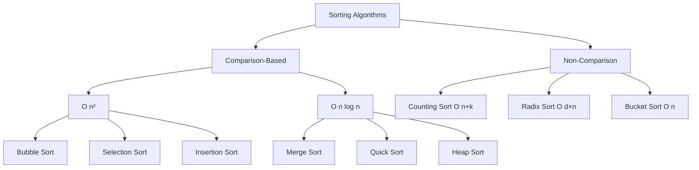
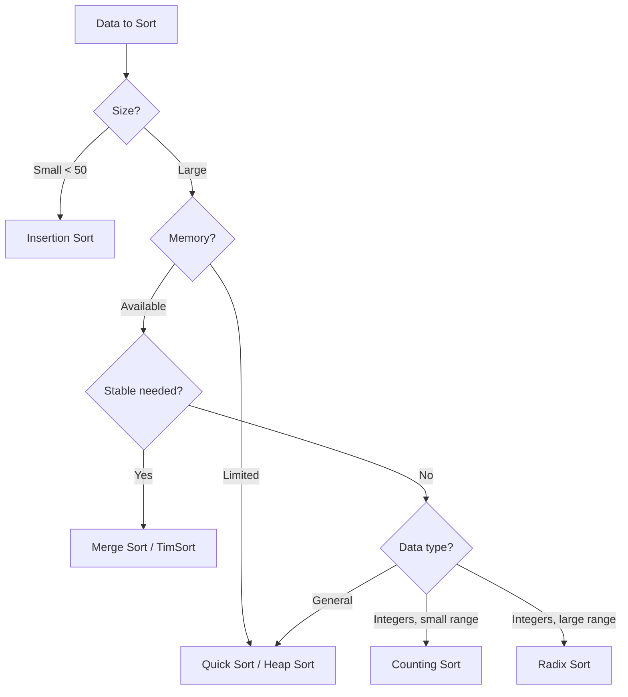

# Sorting Algorithms

## Table of Contents

1. [Implementation Overview](#1-implementation-overview)
2. [Codebase Analysis](#2-codebase-analysis)
3. [Core Operations & Time Complexities](#3-core-operations--time-complexities)
4. [Design Patterns Used](#4-design-patterns-used)
5. [Industry Patterns & Real-World Applications](#5-industry-patterns--real-world-applications)
6. [Performance Optimizations](#6-performance-optimizations)
7. [Edge Cases & Error Handling](#7-edge-cases--error-handling)
8. [Usage Examples](#8-usage-examples)
9. [Best Practices & Gotchas](#9-best-practices--gotchas)
10. [Related Patterns & Alternatives](#10-related-patterns--alternatives)

---

## 1. Implementation Overview

### What is Sorting?

Sorting is the process of arranging elements in a specific order (ascending, descending, or custom). It's a fundamental operation that enables efficient searching, data analysis, and algorithm optimization.

### Algorithm Classification



### Codebase Coverage

| File                      | Algorithm                     | Type                      |
| ------------------------- | ----------------------------- | ------------------------- |
| `SortingAlgorithms1.java` | Insertion Sort                | Comparison O(n²)          |
| `SortingAlgorithms2.java` | Selection Sort, Bidirectional | Comparison O(n²)          |
| `SortingAlgorithms3.java` | Bubble Sort, Brick Sort       | Comparison O(n²)          |
| `SortingAlgorithms4.java` | Counting Sort                 | Non-comparison O(n+k)     |
| `SortingAlgorithms5.java` | Radix Sort                    | Non-comparison O(d×n)     |
| `SortingAlgorithms6.java` | Pigeonhole Sort               | Non-comparison O(n+range) |
| `SortingAlgorithms7.java` | Cycle Sort                    | In-place O(n²)            |
| `CycleSortProblem1.java`  | Find missing numbers          | Cycle sort application    |
| `CycleSortProblem2.java`  | Find duplicates               | Cycle sort application    |

---

## 2. Codebase Analysis

### Insertion Sort (`SortingAlgorithms1.java`)

```java
static int[] insertionSort(int[] arr) {
    for (int i = 1; i < arr.length; i++) {
        int key = arr[i];
        int j = i - 1;

        // Shift elements greater than key to the right
        while (j >= 0 && arr[j] > key) {
            arr[j + 1] = arr[j];
            j--;
        }

        arr[j + 1] = key;  // Insert key at correct position
    }
    return arr;
}
```

**Visualization:**

```
Initial: [64, 34, 25, 12]

Pass 1: key=34, compare with 64
        [34, 64, 25, 12]  ← 64 shifted, 34 inserted

Pass 2: key=25, compare with 64, 34
        [25, 34, 64, 12]  ← 34,64 shifted, 25 inserted

Pass 3: key=12, compare with 64, 34, 25
        [12, 25, 34, 64]  ← All shifted, 12 inserted

Sorted: [12, 25, 34, 64]
```

### Selection Sort (`SortingAlgorithms2.java`)

```java
static int[] selectionSort(int[] arr) {
    int n = arr.length;

    for (int i = 0; i < n - 1; i++) {
        int minIndex = i;

        // Find minimum in unsorted portion
        for (int j = i + 1; j < n; j++) {
            if (arr[j] < arr[minIndex]) {
                minIndex = j;
            }
        }

        // Swap minimum with first unsorted element
        int temp = arr[minIndex];
        arr[minIndex] = arr[i];
        arr[i] = temp;
    }
    return arr;
}
```

#### Bidirectional Selection Sort

```java
static int[] bidirectionSelectionSort(int[] arr) {
    int n = arr.length;

    for (int i = 0; i < n / 2; i++) {
        int minIndex = i;
        int maxIndex = i;

        // Find both min and max in one pass
        for (int j = i + 1; j < n - i; j++) {
            if (arr[j] < arr[minIndex]) minIndex = j;
            if (arr[j] > arr[maxIndex]) maxIndex = j;
        }

        // Swap minimum to front
        int temp = arr[minIndex];
        arr[minIndex] = arr[i];
        arr[i] = temp;

        // Handle case where max was at position i
        if (maxIndex == i) {
            maxIndex = minIndex;
        }

        // Swap maximum to back
        temp = arr[maxIndex];
        arr[maxIndex] = arr[n - i - 1];
        arr[n - i - 1] = temp;
    }
    return arr;
}
```

### Bubble Sort (`SortingAlgorithms3.java`)

```java
static int[] bubbleSort(int[] arr) {
    int n = arr.length;

    for (int i = 0; i < n - 1; i++) {
        boolean swapped = false;

        for (int j = 0; j < n - i - 1; j++) {
            if (arr[j] > arr[j + 1]) {
                int temp = arr[j];
                arr[j] = arr[j + 1];
                arr[j + 1] = temp;
                swapped = true;
            }
        }

        // Optimization: Early termination if no swaps
        if (!swapped) break;
    }
    return arr;
}
```

#### Brick Sort (Odd-Even Sort)

```java
static int[] brickSort(int[] arr) {
    int n = arr.length;
    boolean swapped = true;

    while (swapped) {
        swapped = false;

        // Odd phase: compare odd-even pairs
        for (int i = 0; i < n - 1; i += 2) {
            if (arr[i] > arr[i + 1]) {
                swap(arr, i, i + 1);
                swapped = true;
            }
        }

        // Even phase: compare even-odd pairs
        for (int i = 1; i < n - 1; i += 2) {
            if (arr[i] > arr[i + 1]) {
                swap(arr, i, i + 1);
                swapped = true;
            }
        }
    }
    return arr;
}
```

### Counting Sort (`SortingAlgorithms4.java`)

```java
static int[] countingSort(int[] arr) {
    int n = arr.length;

    // Find maximum element
    int max = arr[0];
    for (int i = 1; i < n; i++) {
        if (arr[i] > max) max = arr[i];
    }

    // Count occurrences
    int[] count = new int[max + 1];
    for (int i = 0; i < n; i++) {
        count[arr[i]]++;
    }

    // Cumulative count (for stable sort)
    for (int i = 1; i < count.length; i++) {
        count[i] += count[i - 1];
    }

    // Build output array (right to left for stability)
    int[] output = new int[n];
    for (int i = n - 1; i >= 0; i--) {
        output[--count[arr[i]]] = arr[i];
    }

    return output;
}
```

**Visualization:**

```
Input: [4, 2, 2, 8, 3, 3, 1]

Step 1: Count occurrences
Count: [0, 1, 2, 2, 1, 0, 0, 0, 1]
        0  1  2  3  4  5  6  7  8

Step 2: Cumulative count
Count: [0, 1, 3, 5, 6, 6, 6, 6, 7]

Step 3: Place elements
Output: [1, 2, 2, 3, 3, 4, 8]
```

### Radix Sort (`SortingAlgorithms5.java`)

```java
static int[] radixSort(int[] arr) {
    int max = arr[0];
    for (int i = 1; i < arr.length; i++) {
        if (arr[i] > max) max = arr[i];
    }

    // Sort by each digit (LSD to MSD)
    for (int digit = 1; max / digit > 0; digit *= 10) {
        arr = countingSort(arr, digit);
    }
    return arr;
}

static int[] countingSort(int[] arr, int digit) {
    int n = arr.length;
    int[] count = new int[10];

    // Count occurrences of each digit
    for (int i = 0; i < n; i++) {
        count[(arr[i] / digit) % 10]++;
    }

    // Cumulative count
    for (int i = 1; i < 10; i++) {
        count[i] += count[i - 1];
    }

    // Build output
    int[] output = new int[n];
    for (int i = n - 1; i >= 0; i--) {
        output[--count[(arr[i] / digit) % 10]] = arr[i];
    }

    return output;
}
```

### Pigeonhole Sort (`SortingAlgorithms6.java`)

```java
static int[] pegionholeSort(int[] arr) {
    int min = arr[0], max = arr[0];

    // Find range
    for (int i = 1; i < arr.length; i++) {
        if (arr[i] < min) min = arr[i];
        if (arr[i] > max) max = arr[i];
    }

    int range = max - min + 1;
    int[] pegionhole = new int[range];

    // Count elements
    for (int i = 0; i < arr.length; i++) {
        pegionhole[arr[i] - min]++;
    }

    // Reconstruct sorted array
    int index = 0;
    for (int i = 0; i < range; i++) {
        while (pegionhole[i] > 0) {
            arr[index++] = i + min;
            pegionhole[i]--;
        }
    }

    return arr;
}
```

### Cycle Sort (`SortingAlgorithms7.java`)

```java
static int[] cycleSort(int[] arr) {
    int n = arr.length;

    for (int cycle = 0; cycle < n - 1; cycle++) {
        int item = arr[cycle];

        // Find correct position
        int position = cycle;
        for (int i = cycle + 1; i < n; i++) {
            if (arr[i] < item) position++;
        }

        if (position == cycle) continue;  // Already in place

        // Skip duplicates
        while (item == arr[position]) position++;

        // Place item
        int temp = arr[position];
        arr[position] = item;
        item = temp;

        // Rotate cycle
        while (position != cycle) {
            position = cycle;
            for (int i = cycle + 1; i < n; i++) {
                if (arr[i] < item) position++;
            }
            while (item == arr[position]) position++;
            temp = arr[position];
            arr[position] = item;
            item = temp;
        }
    }
    return arr;
}
```

---

## 3. Core Operations & Time Complexities

### Comprehensive Comparison Table

| Algorithm       | Best     | Average | Worst  | Space  | Stable | Adaptive |
| --------------- | -------- | ------- | ------ | ------ | ------ | -------- |
| Insertion Sort  | **O(n)** | O(n²)   | O(n²)  | O(1)   | ✅     | ✅       |
| Selection Sort  | O(n²)    | O(n²)   | O(n²)  | O(1)   | ❌     | ❌       |
| Bubble Sort     | **O(n)** | O(n²)   | O(n²)  | O(1)   | ✅     | ✅       |
| Brick Sort      | **O(n)** | O(n²)   | O(n²)  | O(1)   | ✅     | ✅       |
| Counting Sort   | O(n+k)   | O(n+k)  | O(n+k) | O(n+k) | ✅     | ❌       |
| Radix Sort      | O(d×n)   | O(d×n)  | O(d×n) | O(n+k) | ✅     | ❌       |
| Pigeonhole Sort | O(n+r)   | O(n+r)  | O(n+r) | O(r)   | ✅     | ❌       |
| Cycle Sort      | O(n²)    | O(n²)   | O(n²)  | O(1)   | ❌     | ❌       |

_Where: k = range of input, d = number of digits, r = range of values, n = input size_

### Memory Write Comparison

| Algorithm      | Memory Writes | Notes           |
| -------------- | ------------- | --------------- |
| Selection Sort | O(n)          | n swaps maximum |
| Insertion Sort | O(n²)         | Many shifts     |
| Bubble Sort    | O(n²)         | Many swaps      |
| Cycle Sort     | **O(n)**      | Minimum writes! |
| Counting Sort  | O(n)          | Output array    |

### Visual Complexity Graph

```
Operations
    ^
    |                           O(n²)
    |                        _______
    |                    ___/
    |                ___/
    |            ___/
    |        ___/ O(n log n)
    |    ___/ _______
    |___/____/ O(n) for special cases
    +-------------------------> Input Size (n)
```

---

## 4. Design Patterns Used

### 1. **Incremental Build Pattern** (Insertion Sort)

Build sorted portion incrementally:

```java
// Invariant: arr[0..i-1] is sorted
for (int i = 1; i < n; i++) {
    // Insert arr[i] into sorted portion
    int key = arr[i];
    int j = i - 1;
    while (j >= 0 && arr[j] > key) {
        arr[j + 1] = arr[j];
        j--;
    }
    arr[j + 1] = key;
    // Invariant: arr[0..i] is now sorted
}
```

### 2. **Selection Pattern** (Selection Sort)

Repeatedly select optimal element:

```java
for (int i = 0; i < n - 1; i++) {
    // Select: Find minimum in unsorted portion
    int minIdx = selectMinimum(arr, i, n);

    // Place: Swap to correct position
    swap(arr, i, minIdx);
}
```

### 3. **Bubble/Exchange Pattern** (Bubble Sort)

Repeatedly exchange adjacent elements:

```java
// Invariant: Last i elements are in final position
for (int i = 0; i < n - 1; i++) {
    for (int j = 0; j < n - i - 1; j++) {
        if (arr[j] > arr[j + 1]) {
            swap(arr, j, j + 1);  // Bubble up
        }
    }
}
```

### 4. **Counting/Bucketing Pattern** (Counting Sort)

Count occurrences, then reconstruct:

```java
// Step 1: Count
for (int x : arr) count[x]++;

// Step 2: Cumulative count (for positions)
for (int i = 1; i < k; i++) count[i] += count[i-1];

// Step 3: Place elements
for (int i = n - 1; i >= 0; i--) {
    output[--count[arr[i]]] = arr[i];
}
```

### 5. **Digit-by-Digit Pattern** (Radix Sort)

Process digits from least to most significant:

```java
for (int digit = 1; max / digit > 0; digit *= 10) {
    // Sort by current digit using stable sort
    countingSortByDigit(arr, digit);
}
```

### 6. **Cycle Detection Pattern** (Cycle Sort)

Find cycles and rotate:

```java
// Each element belongs to exactly one cycle
// Rotate elements in cycle to correct positions
// Minimizes total memory writes
```

---

## 5. Industry Patterns & Real-World Applications

### Production Use Cases

| Application         | Preferred Sort          | Reason                  |
| ------------------- | ----------------------- | ----------------------- |
| Database Sorting    | Quick Sort / Merge Sort | General efficiency      |
| Nearly Sorted Data  | Insertion Sort          | O(n) best case          |
| Linked Lists        | Merge Sort              | No random access needed |
| External Sorting    | Merge Sort              | Sequential access       |
| Small Arrays (< 10) | Insertion Sort          | Low overhead            |
| Integer Keys        | Counting/Radix          | O(n) possible           |
| Flash Memory        | Cycle Sort              | Minimize writes         |
| Parallel Systems    | Brick Sort / Merge      | Parallelizable          |

### Java's Arrays.sort() Implementation

```java
// Java uses Dual-Pivot Quicksort for primitives
// And TimSort for objects

// For primitives (int, long, etc.):
// - Dual-pivot quicksort (by Vladimir Yaroslavskiy)
// - Falls back to insertion sort for small arrays
// - Handles edge cases specially

// For objects:
// - TimSort (hybrid merge sort + insertion sort)
// - Stable sort (preserves equal element order)
// - Optimized for partially sorted data
```

### Linux Kernel's Sort

```c
// Linux uses heapsort for kernel sorting
// Reasons:
// - O(1) extra space
// - O(n log n) guaranteed
// - No recursion (important for kernel)

void sort(void *base, size_t num, size_t size,
          int (*cmp)(const void *, const void *),
          void (*swap)(void *, void *, int)) {
    // Heapsort implementation
}
```

### Database Index Building

```
B-Tree Index Construction:
1. Bulk load: Sort all keys first
2. Build tree bottom-up
3. Sorting step uses external merge sort

Sort-Merge Join:
Table A × Table B
1. Sort A by join key
2. Sort B by join key
3. Merge sorted results
```

### Google's Sorting Infrastructure

```python
# MapReduce sorting pattern
# Used for massive distributed sorting

Map Phase:
    for record in input:
        emit(key, record)

Shuffle Phase (implicit sort):
    # Framework sorts by key
    # Groups records by key

Reduce Phase:
    for key, records in grouped:
        process(records)  # Records arrive sorted!
```

---

## 6. Performance Optimizations

### Optimization 1: Early Termination (Bubble Sort)

```java
// Original: Always O(n²) comparisons
for (int i = 0; i < n - 1; i++) {
    for (int j = 0; j < n - i - 1; j++) {
        // compare and swap
    }
}

// Optimized: Early exit if sorted
for (int i = 0; i < n - 1; i++) {
    boolean swapped = false;
    for (int j = 0; j < n - i - 1; j++) {
        if (arr[j] > arr[j + 1]) {
            swap(arr, j, j + 1);
            swapped = true;
        }
    }
    if (!swapped) break;  // Already sorted!
}
```

### Optimization 2: Binary Insertion Sort

```java
// Standard insertion: O(n) comparisons per element
// Binary insertion: O(log n) comparisons per element

static void binaryInsertionSort(int[] arr) {
    for (int i = 1; i < arr.length; i++) {
        int key = arr[i];

        // Binary search for insertion point
        int pos = binarySearch(arr, 0, i - 1, key);

        // Shift elements
        System.arraycopy(arr, pos, arr, pos + 1, i - pos);
        arr[pos] = key;
    }
}
```

### Optimization 3: Hybrid Sorting (TimSort Pattern)

```java
// Use insertion sort for small subarrays
static final int INSERTION_THRESHOLD = 32;

void hybridSort(int[] arr, int low, int high) {
    if (high - low < INSERTION_THRESHOLD) {
        insertionSort(arr, low, high);  // Small array
    } else {
        int mid = (low + high) / 2;
        hybridSort(arr, low, mid);
        hybridSort(arr, mid + 1, high);
        merge(arr, low, mid, high);
    }
}
```

### Optimization 4: Three-Way Partitioning

```java
// For arrays with many duplicates
// Dutch National Flag algorithm
void threeWayPartition(int[] arr, int pivot) {
    int low = 0, mid = 0, high = arr.length - 1;

    while (mid <= high) {
        if (arr[mid] < pivot) {
            swap(arr, low++, mid++);
        } else if (arr[mid] > pivot) {
            swap(arr, mid, high--);
        } else {
            mid++;  // Equal to pivot
        }
    }
    // Result: [< pivot | == pivot | > pivot]
}
```

### Cache Performance

| Algorithm      | Cache Behavior | Reason            |
| -------------- | -------------- | ----------------- |
| Insertion Sort | Good           | Sequential access |
| Selection Sort | Poor           | Random access     |
| Bubble Sort    | Excellent      | Adjacent access   |
| Merge Sort     | Good           | Sequential merge  |
| Quick Sort     | Variable       | Depends on pivot  |
| Radix Sort     | Moderate       | Multiple passes   |

---

## 7. Edge Cases & Error Handling

### Edge Cases to Test

| Scenario          | Expected Behavior               |
| ----------------- | ------------------------------- |
| Empty array       | Return empty array              |
| Single element    | Return unchanged                |
| Already sorted    | Return unchanged (efficiently)  |
| Reverse sorted    | Sort correctly                  |
| All same elements | Return unchanged                |
| Two elements      | Sort correctly                  |
| Negative numbers  | Sort correctly                  |
| Large range       | Handle memory for counting sort |
| Integer overflow  | Avoid in comparisons            |

### Input Validation

```java
static int[] robustSort(int[] arr) {
    // Null check
    if (arr == null) {
        throw new IllegalArgumentException("Array cannot be null");
    }

    // Empty/single element
    if (arr.length <= 1) {
        return arr;  // Already sorted
    }

    // Check for counting sort applicability
    int max = findMax(arr);
    int min = findMin(arr);

    if (max - min <= arr.length * 10) {
        // Small range: use counting sort
        return countingSort(arr, min, max);
    } else {
        // Large range: use comparison sort
        return quickSort(arr);
    }
}
```

### Stability Test

```java
// Test that equal elements maintain relative order
class Pair implements Comparable<Pair> {
    int value;
    int originalIndex;

    public int compareTo(Pair other) {
        return Integer.compare(this.value, other.value);
    }
}

void testStability() {
    Pair[] arr = {
        new Pair(3, 0), new Pair(1, 1), new Pair(3, 2), new Pair(2, 3)
    };
    stableSort(arr);

    // After stable sort, pairs with value 3 should be in order: (3,0), (3,2)
    assert arr[2].originalIndex == 0;
    assert arr[3].originalIndex == 2;
}
```

---

## 8. Usage Examples

### Basic Sorting

```java
int[] arr = {64, 34, 25, 12, 22, 11, 90};

// Insertion Sort
int[] sorted = insertionSort(arr.clone());
// Result: [11, 12, 22, 25, 34, 64, 90]

// Selection Sort
sorted = selectionSort(arr.clone());
// Result: [11, 12, 22, 25, 34, 64, 90]

// Bubble Sort
sorted = bubbleSort(arr.clone());
// Result: [11, 12, 22, 25, 34, 64, 90]
```

### Counting Sort for Small Range

```java
int[] arr = {4, 2, 2, 8, 3, 3, 1};
int[] sorted = countingSort(arr);
// Result: [1, 2, 2, 3, 3, 4, 8]
```

### Radix Sort for Large Numbers

```java
int[] arr = {170, 45, 75, 90, 802, 24, 2, 66};
int[] sorted = radixSort(arr);
// Result: [2, 24, 45, 66, 75, 90, 170, 802]

// Process:
// By 1s digit: [170, 90, 802, 2, 24, 45, 75, 66]
// By 10s digit: [802, 2, 24, 45, 66, 170, 75, 90]
// By 100s digit: [2, 24, 45, 66, 75, 90, 170, 802]
```

### Cycle Sort Applications

```java
// Find missing numbers (CycleSortProblem1.java)
int[] nums = {4, 3, 2, 7, 8, 2, 3, 1};
List<Integer> missing = findDisappearedNumbers(nums);
// Result: [5, 6]

// Find duplicates (CycleSortProblem2.java)
int[] nums2 = {4, 3, 7, 5, 6, 2, 3, 1};
int duplicate = findDuplicate(nums2);
// Result: 3
```

---

## 9. Best Practices & Gotchas

### ✅ Best Practices

1. **Choose algorithm based on data characteristics**

```java
// Small array (n < 50): Insertion sort
if (arr.length < 50) return insertionSort(arr);

// Nearly sorted: Insertion sort
if (isNearlySorted(arr)) return insertionSort(arr);

// Integer keys with small range: Counting sort
if (max - min < arr.length * 2) return countingSort(arr);

// General case: Quick sort or merge sort
return Arrays.sort(arr);
```

2. **Use stable sort when order matters**

```java
// Sorting students by grade, then by name
Arrays.sort(students, Comparator.comparing(Student::getName));  // First
Arrays.sort(students, Comparator.comparing(Student::getGrade)); // Then
// Students with same grade are ordered by name (stability)
```

3. **Consider memory constraints**

```java
// In-place needed: Quick sort, Heap sort
// Extra memory OK: Merge sort, Counting sort
```

4. **Test with edge cases**

```java
testSort(new int[]{});           // Empty
testSort(new int[]{1});          // Single
testSort(new int[]{2, 1});       // Two elements
testSort(new int[]{1, 2, 3});    // Already sorted
testSort(new int[]{3, 2, 1});    // Reverse sorted
testSort(new int[]{5, 5, 5});    // All equal
```

### ⚠️ Common Gotchas

1. **Counting sort with negative numbers**

```java
// WRONG: Negative index!
int[] count = new int[max + 1];
count[arr[i]]++;  // Fails for arr[i] < 0

// RIGHT: Offset by minimum
int[] count = new int[max - min + 1];
count[arr[i] - min]++;  // Works for negative
```

2. **Radix sort with negative numbers**

```java
// WRONG: Doesn't handle negatives
for (int digit = 1; max / digit > 0; digit *= 10)

// RIGHT: Separate positive and negative
int[] positive = filterPositive(arr);
int[] negative = filterNegative(arr);
radixSort(positive);
radixSort(negative);  // Sort by absolute value, reverse
// Concatenate: negative (reversed) + positive
```

3. **Stability assumptions**

```java
// WRONG: Assuming selection sort is stable
selectionSort(records);  // Relative order NOT preserved!

// RIGHT: Use stable sort
Arrays.sort(records, comparator);  // TimSort is stable
```

4. **Integer overflow in mid calculation**

```java
// WRONG: Can overflow
int mid = (low + high) / 2;

// RIGHT: Overflow-safe
int mid = low + (high - low) / 2;
```

5. **Modifying array while iterating**

```java
// WRONG: Concurrent modification
for (int x : arr) {
    if (condition) swap(...);
}

// RIGHT: Use index-based loop
for (int i = 0; i < arr.length; i++) {
    if (condition) swap(arr, i, j);
}
```

---

## 10. Related Patterns & Alternatives

### Algorithm Selection Guide



### Related Codebase Files

| File                                                    | Relationship           |
| ------------------------------------------------------- | ---------------------- |
| [BinarySearch\*.java](../src/BinarySearch1.java)        | Requires sorted input  |
| [CycleSortProblem1.java](../src/CycleSortProblem1.java) | Cycle sort application |
| [CycleSortProblem2.java](../src/CycleSortProblem2.java) | Cycle sort application |

### Java Standard Library

```java
// Primitive arrays: Dual-pivot quicksort
Arrays.sort(intArray);

// Object arrays: TimSort (stable)
Arrays.sort(objectArray);

// With comparator
Arrays.sort(array, Comparator.reverseOrder());

// Partial sort
Arrays.sort(array, fromIndex, toIndex);

// Parallel sort (for large arrays)
Arrays.parallelSort(largeArray);
```

### Advanced Sorting Topics

1. **External Sorting** - For data larger than memory
2. **Parallel Sorting** - Multi-threaded approaches
3. **Adaptive Sorting** - Adapts to data patterns
4. **Cache-Oblivious Sorting** - Optimal for all cache levels
5. **GPU Sorting** - Parallel sorting on graphics cards

---

## References

- **CLRS**: Chapter 2 (Insertion Sort), Chapter 7 (Quick Sort), Chapter 8 (Linear-time Sorting)
- **Java Documentation**: `Arrays.sort()`, `Collections.sort()`
- **Linux Kernel**: `lib/sort.c`
- **Google Engineering**: Distributed sorting at scale
- **Database Systems**: External merge sort

---

_Documentation generated for DSA Learning Repository_
_Last Updated: January 2026_
