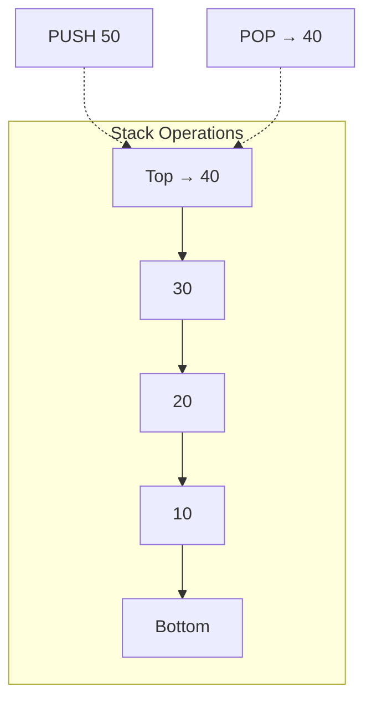
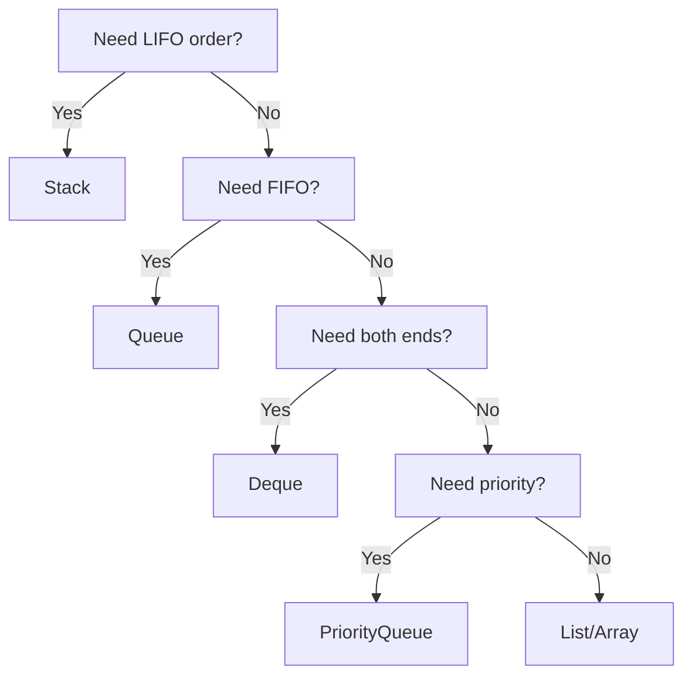

# Stack

## Table of Contents

1. [Implementation Overview](#1-implementation-overview)
2. [Codebase Analysis](#2-codebase-analysis)
3. [Core Operations & Time Complexities](#3-core-operations--time-complexities)
4. [Design Patterns Used](#4-design-patterns-used)
5. [Industry Patterns & Real-World Applications](#5-industry-patterns--real-world-applications)
6. [Performance Optimizations](#6-performance-optimizations)
7. [Edge Cases & Error Handling](#7-edge-cases--error-handling)
8. [Usage Examples](#8-usage-examples)
9. [Best Practices & Gotchas](#9-best-practices--gotchas)
10. [Related Patterns & Alternatives](#10-related-patterns--alternatives)

---

## 1. Implementation Overview

### What is a Stack?

A Stack is a **linear data structure** that follows the **LIFO (Last In First Out)** principle. The last element inserted is the first one to be removed.



### Visual Representation

```
         ┌─────┐
    TOP →│ 40  │  ← PUSH/POP here (LIFO)
         ├─────┤
         │ 30  │
         ├─────┤
         │ 20  │
         ├─────┤
         │ 10  │
         └─────┘
         BOTTOM
```

### Codebase Implementations

The repository contains **multiple stack implementations and applications**:

| File                    | Type                       | Description                               |
| ----------------------- | -------------------------- | ----------------------------------------- |
| `Stack1.java`           | Core Implementation        | Array-based stack with basic operations   |
| `StackUsingQueues.java` | Alternative Implementation | Stack using two queues                    |
| `StackProblem1-9.java`  | Applications               | Various algorithmic problems using stacks |

---

## 2. Codebase Analysis

### Primary Implementation: `Stack1.java`

#### Class Structure

```java
public class Stack1 {
    int[] stack;     // Underlying array storage
    int top;         // Index of top element (-1 if empty)
    int size;        // Maximum capacity

    public Stack1(int n) {
        stack = new int[n];
        top = -1;
        size = n;
    }
}
```

#### Core Methods

```java
// Push Operation - O(1)
public void push(int ele) {
    if (isFull()) {
        System.out.println("Stack is full");
        return;
    } else {
        top++;
        stack[top] = ele;
    }
}

// Pop Operation - O(1)
public int pop() {
    int val = peek();
    if (val != Integer.MIN_VALUE) {
        top--;
    }
    return val;
}

// Peek Operation - O(1)
public int peek() {
    if (isEmpty()) {
        System.out.println("Stack is empty");
        return Integer.MIN_VALUE;
    }
    return stack[top];
}

// State Checks - O(1)
public boolean isEmpty() {
    return top <= -1;
}

public boolean isFull() {
    return top >= size - 1;
}

public int size() {
    return top + 1;
}
```

### Alternative Implementation: `StackUsingQueues.java`

```java
public class StackUsingQueues {
    private Queue<Integer> mainQueue;
    private Queue<Integer> tempQueue;

    public StackUsingQueues() {
        mainQueue = new LinkedList<Integer>();
        tempQueue = new LinkedList<Integer>();
    }

    // Push - O(1)
    public void push(int value) {
        mainQueue.offer(value);
    }

    // Pop - O(n) - Must transfer all elements
    public int pop() {
        if (mainQueue.isEmpty()) {
            throw new IllegalStateException("Stack is empty");
        }

        // Move all except last to temp
        while (mainQueue.size() > 1) {
            tempQueue.offer(mainQueue.poll());
        }

        int poppedValue = mainQueue.poll();

        // Swap queues
        Queue<Integer> temp = mainQueue;
        mainQueue = tempQueue;
        tempQueue = temp;

        return poppedValue;
    }
}
```

### Stack Applications in Codebase

#### Problem Categories Found:

| Problem                   | File                                       | Algorithm Pattern   |
| ------------------------- | ------------------------------------------ | ------------------- |
| Valid Parentheses         | `StackProblem1.java`                       | Matching brackets   |
| Minimum Reversals         | `StackProblem1.java`                       | Balance counting    |
| Min Additions Valid       | `StackProblem2.java`                       | Open/close tracking |
| Minimum Swaps             | `StackProblem2.java`, `StackProblem3.java` | Balance restoration |
| Asteroid Collision        | `StackProblem4.java`                       | Simulation          |
| Stock Span                | `StackProblem5.java`                       | Monotonic stack     |
| Next Greater Element      | `StackProblem6.java`, `StackProblem7.java` | Monotonic stack     |
| Largest Rectangle         | `StackProblem8.java`                       | Monotonic stack     |
| Longest Valid Parentheses | `StackProblem9.java`                       | Index tracking      |

---

## 3. Core Operations & Time Complexities

### Complexity Analysis Table

| Operation      | Array Stack | Queue-Based Stack | Linked List Stack |
| -------------- | ----------- | ----------------- | ----------------- |
| `push()`       | **O(1)**    | O(1) or O(n)\*    | O(1)              |
| `pop()`        | **O(1)**    | O(n)              | O(1)              |
| `peek()/top()` | **O(1)**    | O(n)              | O(1)              |
| `isEmpty()`    | **O(1)**    | O(1)              | O(1)              |
| `isFull()`     | **O(1)**    | N/A               | N/A               |
| `size()`       | **O(1)**    | O(1)              | O(1)              |
| `getMin()`     | O(n)        | O(n)              | O(1)\*\*          |
| `getMax()`     | O(n)        | O(n)              | O(1)\*\*          |

\*Depends on implementation variant
\*\*With auxiliary stack

### Space Complexity

| Implementation   | Space        | Notes                          |
| ---------------- | ------------ | ------------------------------ |
| Array-based      | O(n) fixed   | Pre-allocated, may waste space |
| LinkedList-based | O(n) dynamic | Node overhead per element      |
| Queue-based      | O(n)         | Two queue overhead             |

### Cache Performance Analysis

```
Array Stack (Excellent Cache Locality):
┌────────────────────────────────────────────┐
│ [10][20][30][40][50][ ][ ][ ]             │ ← Contiguous memory
└────────────────────────────────────────────┘
  Cache Line 1        Cache Line 2

LinkedList Stack (Poor Cache Locality):
┌────┐     ┌────┐     ┌────┐
│ 10 │ ──→ │ 20 │ ──→ │ 30 │  ← Scattered in heap
└────┘     └────┘     └────┘
Heap Addr:  0x100      0x5F0      0x2A0
```

---

## 4. Design Patterns Used

### 1. **Monotonic Stack Pattern**

Used extensively in problems for finding next greater/smaller elements.

```java
// From StackProblem6.java - Next Greater Element
static ArrayList<Integer> nextLargerElement(int[] arr) {
    Stack<Integer> stack = new Stack<>();
    ArrayList<Integer> result = new ArrayList<>(arr.length);

    // Process from right to left
    for (int i = arr.length - 1; i >= 0; i--) {
        // Pop smaller elements - maintaining decreasing order
        while (!stack.isEmpty() && stack.peek() <= arr[i]) {
            stack.pop();
        }

        if (stack.isEmpty()) {
            result.add(0, -1);
        } else {
            result.add(0, stack.peek());
        }

        stack.push(arr[i]);
    }

    return result;
}
```

**Pattern Visualization:**

```
Array: [4, 5, 2, 10, 8]
Processing right-to-left:

Step 1: 8 → Stack: [8]      Result: [..., -1]
Step 2: 10 → Stack: [10]    Result: [..., -1, -1]  (8 popped)
Step 3: 2 → Stack: [10, 2]  Result: [..., 10, -1, -1]
Step 4: 5 → Stack: [10, 5]  Result: [..., 10, 10, -1, -1] (2 popped)
Step 5: 4 → Stack: [10,5,4] Result: [5, 10, 10, -1, -1]

Final: [5, 10, 10, -1, -1]
```

### 2. **Bracket Matching Pattern**

```java
// From StackProblem1.java
static boolean isValid(String s) {
    if (s.length() % 2 != 0) return false;

    Stack<Character> stack = new Stack<>();

    for (int i = 0; i < s.length(); i++) {
        char ch = s.charAt(i);

        if (ch == '(' || ch == '[' || ch == '{') {
            stack.add(ch);  // Opening bracket: push
        } else {
            if (stack.isEmpty()) return false;

            char top = stack.pop();
            // Matching validation
            if ((ch == ')' && top != '(') ||
                (ch == ']' && top != '[') ||
                (ch == '}' && top != '{')) {
                return false;
            }
        }
    }

    return stack.isEmpty();
}
```

### 3. **Two-Stack Min/Max Pattern**

```java
// Enhanced Min Stack (Industry Standard)
class MinStack {
    private Stack<Integer> mainStack = new Stack<>();
    private Stack<Integer> minStack = new Stack<>();

    public void push(int val) {
        mainStack.push(val);
        if (minStack.isEmpty() || val <= minStack.peek()) {
            minStack.push(val);
        }
    }

    public void pop() {
        if (mainStack.peek().equals(minStack.peek())) {
            minStack.pop();
        }
        mainStack.pop();
    }

    public int getMin() {
        return minStack.peek();  // O(1) instead of O(n)
    }
}
```

### 4. **Index-Based Stack Pattern**

```java
// From StackProblem8.java - Largest Rectangle
static int[] findPrevSmaller(int[] arr) {
    Stack<Integer> stack = new Stack<>();  // Store indices, not values
    int[] result = new int[arr.length];

    for (int i = 0; i < arr.length; i++) {
        while (!stack.isEmpty() && arr[stack.peek()] >= arr[i]) {
            stack.pop();
        }

        result[i] = stack.isEmpty() ? -1 : stack.peek();
        stack.push(i);  // Push index
    }

    return result;
}
```

### 5. **Simulation Pattern**

```java
// From StackProblem4.java - Asteroid Collision
static int[] asteroidCollision(int[] asteroids) {
    Stack<Integer> stack = new Stack<>();

    for (int asteroid : asteroids) {
        if (asteroid > 0) {
            stack.push(asteroid);  // Right-moving: just add
        } else {
            // Left-moving: collision logic
            while (!stack.isEmpty() && stack.peek() > 0
                   && stack.peek() < Math.abs(asteroid)) {
                stack.pop();  // Smaller right-moving destroyed
            }

            if (!stack.isEmpty() && stack.peek() == Math.abs(asteroid)) {
                stack.pop();  // Both destroyed
            } else if (stack.isEmpty() || stack.peek() < 0) {
                stack.push(asteroid);  // Survives
            }
        }
    }
    // ... convert stack to array
}
```

---

## 5. Industry Patterns & Real-World Applications

### Production Use Cases

| Application           | System                    | Stack Usage            |
| --------------------- | ------------------------- | ---------------------- |
| Function Call Stack   | All Programming Languages | Activation records     |
| Undo/Redo             | Text Editors, Photoshop   | Action history         |
| Browser History       | Chrome, Firefox           | Back button navigation |
| Expression Evaluation | Calculators, Compilers    | Infix to postfix       |
| Syntax Parsing        | Compilers (GCC, LLVM)     | AST construction       |
| Memory Management     | OS, JVM                   | Stack frames           |
| Backtracking          | Game Engines, Puzzles     | State restoration      |

### JVM Implementation

```java
// Each thread has its own stack
// Stack frame structure:
┌─────────────────────────────────────┐
│         Stack Frame                  │
├─────────────────────────────────────┤
│ Local Variables Array                │
│ [0]: this (if instance method)       │
│ [1]: arg1                            │
│ [2]: arg2                            │
│ [3]: local1                          │
├─────────────────────────────────────┤
│ Operand Stack                        │
│ (for intermediate calculations)      │
├─────────────────────────────────────┤
│ Frame Data                           │
│ - Return address                     │
│ - Exception table reference          │
│ - Constant pool reference            │
└─────────────────────────────────────┘
```

### Google V8 Engine Pattern

```cpp
// V8's call stack for JavaScript execution
class CallStack {
    std::vector<StackFrame> frames_;

    void PushFrame(const StackFrame& frame) {
        if (frames_.size() >= kMaxStackSize) {
            throw StackOverflowError();
        }
        frames_.push_back(frame);
    }

    StackFrame PopFrame() {
        StackFrame top = frames_.back();
        frames_.pop_back();
        return top;
    }
};
```

### Database Transaction Stack (PostgreSQL Pattern)

```sql
-- Savepoint stack for nested transactions
BEGIN;
    INSERT INTO users VALUES (1, 'Alice');
    SAVEPOINT sp1;  -- Push to stack
        INSERT INTO orders VALUES (1, 1, 100);
        SAVEPOINT sp2;  -- Push to stack
            -- Error occurs
        ROLLBACK TO sp2;  -- Pop and restore
    -- sp1 still active
COMMIT;
```

---

## 6. Performance Optimizations

### Current Implementation vs Optimized

#### Issue 1: Fixed Size Array

```java
// Current - Fixed size
public Stack1(int n) {
    stack = new int[n];
    top = -1;
    size = n;
}

// Optimized - Dynamic resizing (like ArrayList)
public class DynamicStack {
    private int[] stack;
    private int top = -1;
    private static final int INITIAL_CAPACITY = 16;

    public DynamicStack() {
        stack = new int[INITIAL_CAPACITY];
    }

    public void push(int ele) {
        if (top == stack.length - 1) {
            resize(stack.length * 2);  // Double capacity
        }
        stack[++top] = ele;
    }

    private void resize(int newCapacity) {
        int[] newStack = new int[newCapacity];
        System.arraycopy(stack, 0, newStack, 0, top + 1);
        stack = newStack;
    }
}
```

**Amortized Analysis:**

- Push: O(1) amortized (occasional O(n) for resize)
- Memory: Grows on demand, shrinks when 25% full

#### Issue 2: getMin/getMax are O(n)

```java
// Current - O(n)
public int getMin() {
    int min = stack[top];
    for (int i = 0; i <= top; i++) {
        if (stack[i] < min) {
            min = stack[i];
        }
    }
    return min;
}

// Optimized - O(1) with space trade-off
public class MinMaxStack {
    private int[] values;
    private int[] minStack;
    private int[] maxStack;
    private int top = -1;

    public void push(int val) {
        top++;
        values[top] = val;
        minStack[top] = (top == 0) ? val : Math.min(val, minStack[top-1]);
        maxStack[top] = (top == 0) ? val : Math.max(val, maxStack[top-1]);
    }

    public int getMin() { return minStack[top]; }  // O(1)
    public int getMax() { return maxStack[top]; }  // O(1)
}
```

#### Issue 3: Array vs Stack Class Usage in Problems

```java
// Using java.util.Stack (Synchronized - slower)
Stack<Integer> stack = new Stack<>();  // Thread-safe but slow

// Better: Use ArrayDeque (Not synchronized - faster)
Deque<Integer> stack = new ArrayDeque<>();
stack.push(value);
stack.pop();
stack.peek();

// Best: Use primitive array for competitive programming
int[] stack = new int[MAX_SIZE];
int top = -1;
stack[++top] = value;  // push
int val = stack[top--]; // pop
```

### Benchmark Comparison

| Implementation        | Push (ns) | Pop (ns) | Memory Overhead |
| --------------------- | --------- | -------- | --------------- |
| `Stack<Integer>`      | ~150      | ~120     | High (boxing)   |
| `ArrayDeque<Integer>` | ~80       | ~60      | Medium (boxing) |
| `int[]` array         | ~10       | ~8       | None            |

---

## 7. Edge Cases & Error Handling

### Current Implementation Analysis

```java
// Stack1.java error handling
public void push(int ele) {
    if (isFull()) {
        System.out.println("Stack is full");  // Silent failure
        return;
    }
    // ...
}

public int peek() {
    if (isEmpty()) {
        System.out.println("Stack is empty");
        return Integer.MIN_VALUE;  // Sentinel value
    }
    return stack[top];
}
```

### Problems with Current Approach

| Issue              | Current Behavior            | Problem                           |
| ------------------ | --------------------------- | --------------------------------- |
| Push to full stack | Prints message, returns     | Silent failure, no exception      |
| Pop from empty     | Returns `Integer.MIN_VALUE` | Can't distinguish from valid data |
| No null safety     | N/A (primitive int)         | OK for primitives                 |
| No thread safety   | Unprotected                 | Race conditions possible          |

### Recommended Error Handling

```java
public class RobustStack {

    public void push(int ele) {
        if (isFull()) {
            throw new StackOverflowError("Stack capacity exceeded");
        }
        stack[++top] = ele;
    }

    public int pop() {
        if (isEmpty()) {
            throw new EmptyStackException();
        }
        return stack[top--];
    }

    public int peek() {
        if (isEmpty()) {
            throw new EmptyStackException();
        }
        return stack[top];
    }

    public Optional<Integer> safePeek() {
        return isEmpty() ? Optional.empty() : Optional.of(stack[top]);
    }
}
```

### Edge Cases to Test

| Scenario                     | Expected Behavior                                    |
| ---------------------------- | ---------------------------------------------------- |
| Push to full stack           | Throw StackOverflowError                             |
| Pop from empty stack         | Throw EmptyStackException                            |
| Peek at empty stack          | Throw EmptyStackException or return Optional.empty() |
| Size after multiple push/pop | Correct count                                        |
| Push MAX_VALUE/MIN_VALUE     | Handle correctly                                     |
| Alternating push/pop         | Correct LIFO order                                   |

---

## 8. Usage Examples

### Basic Stack Operations

```java
public static void main(String[] args) {
    Stack1 stack = new Stack1(5);

    stack.push(10);
    stack.push(20);
    stack.push(30);
    stack.push(40);

    System.out.println(stack.pop());   // 40
    System.out.println(stack.pop());   // 30
    System.out.println(stack.peek());  // 20 (doesn't remove)

    stack.printStack();  // 10 20
}
```

### Parentheses Validation

```java
// From StackProblem1.java
String balanced = "([{}])";
String unbalanced = "([{]})";

System.out.println(isValid(balanced));   // true
System.out.println(isValid(unbalanced)); // false
```

### Stock Span Problem

```java
// From StackProblem5.java
StockSpanner stockSpanner = new StockSpanner();

stockSpanner.next(100); // 1 (no previous day)
stockSpanner.next(80);  // 1 (100 > 80)
stockSpanner.next(60);  // 1 (80 > 60)
stockSpanner.next(70);  // 2 (60 <= 70, 80 > 70)
stockSpanner.next(60);  // 1 (70 > 60)
stockSpanner.next(75);  // 4 (60, 70, 60 <= 75, 80 > 75)
stockSpanner.next(85);  // 6 (all previous <= 85)
```

### Largest Rectangle in Histogram

```java
// From StackProblem8.java
int[] heights = {2, 1, 5, 6, 2, 3};
System.out.println(largestRectangleArea(heights));  // 10

// Visualization:
//       ┌───┐
//   ┌───┤   │
//   │   │   │    ┌───┐
// ┌─┤   │   ├───┤   │
// │ │   │   │   │   │
// └─┴───┴───┴───┴───┘
//  2   1   5   6   2   3
//
// Largest rectangle: 5 x 2 = 10 (heights[2] and heights[3])
```

---

## 9. Best Practices & Gotchas

### ✅ Best Practices

1. **Use ArrayDeque over Stack class**

```java
// Avoid (synchronized, slow)
Stack<Integer> stack = new Stack<>();

// Prefer (not synchronized, faster)
Deque<Integer> stack = new ArrayDeque<>();
```

2. **Use primitive arrays for performance-critical code**

```java
// Competitive programming pattern
int[] stack = new int[100001];
int top = -1;

// Push
stack[++top] = value;

// Pop
int val = stack[top--];

// Peek
int peek = stack[top];
```

3. **Store indices instead of values when needed**

```java
// Finding next greater element - store indices
Stack<Integer> indexStack = new Stack<>();
for (int i = 0; i < arr.length; i++) {
    while (!indexStack.isEmpty() && arr[indexStack.peek()] < arr[i]) {
        result[indexStack.pop()] = arr[i];
    }
    indexStack.push(i);  // Store index, not value
}
```

4. **Clear references for garbage collection**

```java
public int pop() {
    if (isEmpty()) throw new EmptyStackException();
    int val = stack[top];
    stack[top] = 0;  // Clear reference (for object stacks: null)
    top--;
    return val;
}
```

### ⚠️ Common Gotchas

1. **Stack Overflow with Recursion**

```java
// WRONG: Deep recursion causes stack overflow
void deepRecursion(int n) {
    if (n == 0) return;
    deepRecursion(n - 1);  // Stack frame per call
}
deepRecursion(1000000);  // StackOverflowError!

// CORRECT: Convert to iterative with explicit stack
void iterativeWithStack(int n) {
    Stack<Integer> stack = new Stack<>();
    stack.push(n);
    while (!stack.isEmpty()) {
        int current = stack.pop();
        // Process current
        if (current > 0) stack.push(current - 1);
    }
}
```

2. **Integer.MIN_VALUE as sentinel**

```java
// GOTCHA: MIN_VALUE can be valid data
public int pop() {
    if (isEmpty()) return Integer.MIN_VALUE;  // Ambiguous!
    return stack[top--];
}

// BETTER: Throw exception or use Optional
public int pop() {
    if (isEmpty()) throw new EmptyStackException();
    return stack[top--];
}
```

3. **Off-by-one errors with top index**

```java
// WRONG: top points to next empty slot
stack[top] = value;  // Overwrites wrong position
top++;

// CORRECT: top points to current top element
top++;
stack[top] = value;
// OR
stack[++top] = value;
```

4. **Concurrent modification**

```java
// UNSAFE: Multiple threads
Stack<Integer> shared = new Stack<>();

// Thread 1: push
// Thread 2: pop simultaneously
// Result: Data corruption

// SAFE: Use concurrent structures
ConcurrentLinkedDeque<Integer> safeStack = new ConcurrentLinkedDeque<>();
```

---

## 10. Related Patterns & Alternatives

### Data Structure Comparison

| Feature  | Stack        | Queue      | Deque          | Priority Queue |
| -------- | ------------ | ---------- | -------------- | -------------- |
| Order    | LIFO         | FIFO       | Both           | Priority       |
| Insert   | Top O(1)     | Rear O(1)  | Both O(1)      | O(log n)       |
| Remove   | Top O(1)     | Front O(1) | Both O(1)      | O(log n)       |
| Use Case | Backtracking | BFS        | Sliding Window | Scheduling     |

### When to Use Stack



### Related Codebase Files

| File                                                  | Relationship                  |
| ----------------------------------------------------- | ----------------------------- |
| [QueueExplain.java](../src/QueueExplain.java)         | FIFO alternative              |
| [QueueUsingStack.java](../src/QueueUsingStack.java)   | Queue implemented with stacks |
| [StackUsingQueues.java](../src/StackUsingQueues.java) | Stack implemented with queues |
| [LinkedList.java](../src/LinkedList.java)             | Can implement stack           |

### Advanced Stack Variants

1. **Min Stack** - O(1) getMin()
2. **Max Stack** - O(1) getMax() with popMax()
3. **Two Stack Queue** - Queue using two stacks
4. **Stack with Middle** - O(1) middle element access
5. **Persistent Stack** - Immutable, version history

### Migration to Java Collections

```java
// Custom Stack1 to java.util.Deque
Deque<Integer> javaStack = new ArrayDeque<>();

// Operation mapping:
// push(val) → push(val) or addFirst(val)
// pop() → pop() or removeFirst()
// peek() → peek() or peekFirst()
// isEmpty() → isEmpty()
// size() → size()
```

---

## References

- **Java Documentation**: `java.util.Stack`, `java.util.Deque`
- **CLRS**: Chapter 10.1 - Stacks and Queues
- **JVM Specification**: Stack frame structure
- **LeetCode**: Stack problems collection
- **Google Interview Guide**: Monotonic stack patterns

---

_Documentation generated for DSA Learning Repository_
_Last Updated: January 2026_
