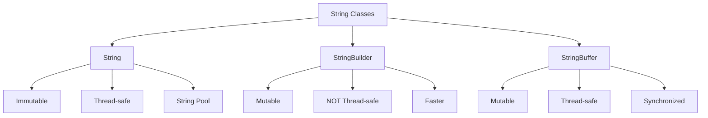
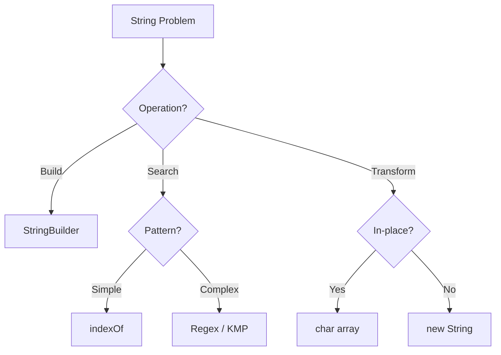

# String Operations

## Table of Contents

1. [Implementation Overview](#1-implementation-overview)
2. [Codebase Analysis](#2-codebase-analysis)
3. [Core Operations & Time Complexities](#3-core-operations--time-complexities)
4. [Design Patterns Used](#4-design-patterns-used)
5. [Industry Patterns & Real-World Applications](#5-industry-patterns--real-world-applications)
6. [Performance Optimizations](#6-performance-optimizations)
7. [Edge Cases & Error Handling](#7-edge-cases--error-handling)
8. [Usage Examples](#8-usage-examples)
9. [Best Practices & Gotchas](#9-best-practices--gotchas)
10. [Related Patterns & Alternatives](#10-related-patterns--alternatives)

---

## 1. Implementation Overview

### Strings in Java

Java provides three main classes for string manipulation:



### Memory Model

```
String Immutability:
┌─────────────────────────────────────────────────────────┐
│                    String Pool (Heap)                    │
├─────────────────────────────────────────────────────────┤
│  "Hello" ──┬──→ char[] {'H','e','l','l','o'}           │
│            │                                             │
│  s1 ───────┘                                            │
│  s2 ───────┘  (Both reference same object)              │
├─────────────────────────────────────────────────────────┤
│  s3 = new String("Hello") → Different object            │
│  s3.intern() → Returns pooled reference                 │
└─────────────────────────────────────────────────────────┘

StringBuilder (Mutable):
┌───────────────────────────────────────┐
│  char[] value = new char[capacity]    │
│  int count = actual length            │
│                                        │
│  append() → Modifies in place         │
│  If capacity exceeded → Grow array    │
└───────────────────────────────────────┘
```

### Codebase Coverage

| File                  | Topics                                 |
| --------------------- | -------------------------------------- |
| `Strings1.java`       | String basics, equality, methods       |
| `String2.java`        | StringBuilder, StringBuffer comparison |
| `Sting3.java`         | String manipulation examples           |
| `StringProblem1.java` | Reverse words in string                |
| `StringProblem2.java` | Anagram detection                      |
| `StringProblem3.java` | In-place word reversal                 |

---

## 2. Codebase Analysis

### String Basics (`Strings1.java`)

```java
// String creation and equality
String s1 = "Hello";           // String pool
String s2 = "Hello";           // Same pool reference
String s3 = new String("Hello"); // New heap object

System.out.println(s1 == s2);      // true (same reference)
System.out.println(s1 == s3);      // false (different objects)
System.out.println(s1.equals(s3)); // true (same content)

// String methods
String str = "Hello World";
str.length();           // 11
str.charAt(0);          // 'H'
str.substring(0, 5);    // "Hello"
str.indexOf("World");   // 6
str.toUpperCase();      // "HELLO WORLD"
str.toLowerCase();      // "hello world"
str.trim();             // Removes leading/trailing spaces
str.split(" ");         // ["Hello", "World"]
str.replace("l", "L");  // "HeLLo WorLd"
```

### StringBuilder vs StringBuffer (`String2.java`)

```java
// StringBuilder - NOT thread-safe, FASTER
StringBuilder sb = new StringBuilder();
sb.append("Hello");
sb.append(" ");
sb.append("World");
String result = sb.toString();  // "Hello World"

// StringBuffer - Thread-safe, SLOWER
StringBuffer buffer = new StringBuffer();
buffer.append("Hello");
buffer.append(" ");
buffer.append("World");
String result = buffer.toString();

// Common methods
sb.insert(5, ",");      // Insert at position
sb.delete(5, 6);        // Delete range
sb.reverse();           // Reverse content
sb.setCharAt(0, 'h');   // Modify character
sb.capacity();          // Current capacity
sb.ensureCapacity(100); // Pre-allocate
```

### String Manipulation (`Sting3.java`)

```java
// Character frequency counting
Map<Character, Integer> frequency = new HashMap<>();
for (char c : str.toCharArray()) {
    frequency.put(c, frequency.getOrDefault(c, 0) + 1);
}

// Palindrome check
boolean isPalindrome(String s) {
    int left = 0, right = s.length() - 1;
    while (left < right) {
        if (s.charAt(left) != s.charAt(right)) {
            return false;
        }
        left++;
        right--;
    }
    return true;
}

// Remove duplicates
String removeDuplicates(String s) {
    Set<Character> seen = new LinkedHashSet<>();
    for (char c : s.toCharArray()) {
        seen.add(c);
    }
    StringBuilder sb = new StringBuilder();
    for (char c : seen) {
        sb.append(c);
    }
    return sb.toString();
}
```

### Reverse Words (`StringProblem1.java`)

```java
// "Hello World Java" → "Java World Hello"
static String reverseWords(String s) {
    String[] words = s.trim().split("\\s+");
    StringBuilder sb = new StringBuilder();

    for (int i = words.length - 1; i >= 0; i--) {
        sb.append(words[i]);
        if (i > 0) sb.append(" ");
    }

    return sb.toString();
}

// Alternative: Using Stack
static String reverseWordsStack(String s) {
    Stack<String> stack = new Stack<>();
    for (String word : s.trim().split("\\s+")) {
        stack.push(word);
    }

    StringBuilder sb = new StringBuilder();
    while (!stack.isEmpty()) {
        sb.append(stack.pop());
        if (!stack.isEmpty()) sb.append(" ");
    }
    return sb.toString();
}
```

### Anagram Detection (`StringProblem2.java`)

```java
// Check if two strings are anagrams
static boolean areAnagrams(String s1, String s2) {
    if (s1.length() != s2.length()) return false;

    // Method 1: Sorting
    char[] arr1 = s1.toLowerCase().toCharArray();
    char[] arr2 = s2.toLowerCase().toCharArray();
    Arrays.sort(arr1);
    Arrays.sort(arr2);
    return Arrays.equals(arr1, arr2);
}

// Method 2: Character counting (more efficient)
static boolean areAnagramsOptimal(String s1, String s2) {
    if (s1.length() != s2.length()) return false;

    int[] count = new int[26];
    for (int i = 0; i < s1.length(); i++) {
        count[s1.charAt(i) - 'a']++;
        count[s2.charAt(i) - 'a']--;
    }

    for (int c : count) {
        if (c != 0) return false;
    }
    return true;
}
```

### In-Place Word Reversal (`StringProblem3.java`)

```java
// "the sky is blue" → "blue is sky the"
// Using char array for in-place operation
static String reverseWordsInPlace(String s) {
    char[] arr = s.trim().toCharArray();

    // Step 1: Reverse entire string
    reverse(arr, 0, arr.length - 1);

    // Step 2: Reverse each word
    int start = 0;
    for (int end = 0; end < arr.length; end++) {
        if (arr[end] == ' ') {
            reverse(arr, start, end - 1);
            start = end + 1;
        }
    }
    reverse(arr, start, arr.length - 1);  // Last word

    return new String(arr);
}

static void reverse(char[] arr, int left, int right) {
    while (left < right) {
        char temp = arr[left];
        arr[left] = arr[right];
        arr[right] = temp;
        left++;
        right--;
    }
}
```

**Visualization:**

```
Original: "the sky is blue"

Step 1 - Reverse all:
"eulb si yks eht"

Step 2 - Reverse each word:
"blue" + " " + "is" + " " + "sky" + " " + "the"
= "blue is sky the"
```

---

## 3. Core Operations & Time Complexities

### String Operations

| Operation         | Time   | Space  | Notes                |
| ----------------- | ------ | ------ | -------------------- |
| `charAt(i)`       | O(1)   | O(1)   | Direct array access  |
| `length()`        | O(1)   | O(1)   | Stored as field      |
| `substring(i, j)` | O(j-i) | O(j-i) | Creates new String   |
| `concat` / `+`    | O(n+m) | O(n+m) | Creates new String   |
| `equals()`        | O(n)   | O(1)   | Character comparison |
| `indexOf()`       | O(n×m) | O(1)   | Naive search         |
| `split()`         | O(n)   | O(n)   | Creates array        |
| `replace()`       | O(n×m) | O(n)   | Creates new String   |

### StringBuilder Operations

| Operation      | Time   | Space  | Notes               |
| -------------- | ------ | ------ | ------------------- |
| `append()`     | O(1)\* | O(1)\* | Amortized           |
| `insert(i, s)` | O(n)   | O(1)   | Shifts elements     |
| `delete(i, j)` | O(n)   | O(1)   | Shifts elements     |
| `reverse()`    | O(n)   | O(1)   | In-place            |
| `toString()`   | O(n)   | O(n)   | Creates new String  |
| `setCharAt()`  | O(1)   | O(1)   | Direct modification |

### Algorithm Complexities

| Algorithm             | Time       | Space  |
| --------------------- | ---------- | ------ |
| Reverse words         | O(n)       | O(n)   |
| Anagram check (sort)  | O(n log n) | O(n)   |
| Anagram check (count) | O(n)       | O(1)   |
| Palindrome check      | O(n)       | O(1)   |
| In-place word reverse | O(n)       | O(1)\* |

_Note: In Java, strings are immutable, so true O(1) space isn't possible without char array conversion._

### Comparison Chart

```
Time to build "Hello" + "World" + "!" repeated 1000 times:

String concatenation:  ████████████████████████████████████ ~10ms
StringBuilder:         ███ ~0.3ms
StringBuffer:          ████ ~0.4ms

StringBuilder is 30x faster for many concatenations!
```

---

## 4. Design Patterns Used

### 1. **Two-Pointer Pattern**

```java
// Palindrome check
boolean isPalindrome(String s) {
    int left = 0, right = s.length() - 1;
    while (left < right) {
        while (left < right && !Character.isLetterOrDigit(s.charAt(left)))
            left++;
        while (left < right && !Character.isLetterOrDigit(s.charAt(right)))
            right--;
        if (Character.toLowerCase(s.charAt(left)) !=
            Character.toLowerCase(s.charAt(right)))
            return false;
        left++;
        right--;
    }
    return true;
}
```

### 2. **Sliding Window Pattern**

```java
// Longest substring without repeating characters
int lengthOfLongestSubstring(String s) {
    Set<Character> window = new HashSet<>();
    int left = 0, maxLen = 0;

    for (int right = 0; right < s.length(); right++) {
        while (window.contains(s.charAt(right))) {
            window.remove(s.charAt(left));
            left++;
        }
        window.add(s.charAt(right));
        maxLen = Math.max(maxLen, right - left + 1);
    }
    return maxLen;
}
```

### 3. **Character Frequency Pattern**

```java
// Count occurrences
Map<Character, Integer> countChars(String s) {
    Map<Character, Integer> freq = new HashMap<>();
    for (char c : s.toCharArray()) {
        freq.merge(c, 1, Integer::sum);
    }
    return freq;
}

// For lowercase letters only (faster)
int[] countCharsArray(String s) {
    int[] freq = new int[26];
    for (char c : s.toCharArray()) {
        freq[c - 'a']++;
    }
    return freq;
}
```

### 4. **Builder Pattern**

```java
// StringBuilder is a classic Builder
StringBuilder sb = new StringBuilder()
    .append("Hello")
    .append(" ")
    .append("World")
    .append("!");
String result = sb.toString();
```

### 5. **Reverse-Reverse Pattern**

```java
// Reverse words: Reverse all, then reverse each word
void reverseWords(char[] s) {
    reverse(s, 0, s.length - 1);  // Reverse all

    int start = 0;
    for (int end = 0; end <= s.length; end++) {
        if (end == s.length || s[end] == ' ') {
            reverse(s, start, end - 1);  // Reverse word
            start = end + 1;
        }
    }
}
```

---

## 5. Industry Patterns & Real-World Applications

### Text Processing

```java
// Log parsing
Pattern logPattern = Pattern.compile(
    "(\\d{4}-\\d{2}-\\d{2}) (\\d{2}:\\d{2}:\\d{2}) (\\w+) (.*)");

void parseLog(String line) {
    Matcher m = logPattern.matcher(line);
    if (m.matches()) {
        String date = m.group(1);
        String time = m.group(2);
        String level = m.group(3);
        String message = m.group(4);
    }
}
```

### URL Encoding/Decoding

```java
// URL safe string
String encode(String s) {
    StringBuilder sb = new StringBuilder();
    for (char c : s.toCharArray()) {
        if (Character.isLetterOrDigit(c) || "-_.~".indexOf(c) >= 0) {
            sb.append(c);
        } else {
            sb.append('%');
            sb.append(String.format("%02X", (int) c));
        }
    }
    return sb.toString();
}
```

### JSON String Building

```java
class JsonBuilder {
    private StringBuilder sb = new StringBuilder();

    JsonBuilder startObject() {
        sb.append("{");
        return this;
    }

    JsonBuilder addString(String key, String value) {
        sb.append("\"").append(escapeJson(key)).append("\":");
        sb.append("\"").append(escapeJson(value)).append("\",");
        return this;
    }

    JsonBuilder endObject() {
        if (sb.charAt(sb.length() - 1) == ',') {
            sb.setLength(sb.length() - 1);  // Remove trailing comma
        }
        sb.append("}");
        return this;
    }

    String build() { return sb.toString(); }
}
```

### Template Engine

```java
// Simple string interpolation
String template = "Hello, ${name}! Your balance is ${balance}.";

String render(String template, Map<String, String> vars) {
    StringBuilder result = new StringBuilder(template);
    for (Map.Entry<String, String> entry : vars.entrySet()) {
        String placeholder = "${" + entry.getKey() + "}";
        int index;
        while ((index = result.indexOf(placeholder)) != -1) {
            result.replace(index, index + placeholder.length(), entry.getValue());
        }
    }
    return result.toString();
}
```

### Search Engine Tokenization

```java
// Word tokenization for indexing
List<String> tokenize(String text) {
    return Arrays.stream(text.toLowerCase()
            .replaceAll("[^a-z0-9\\s]", "")
            .split("\\s+"))
        .filter(s -> !s.isEmpty())
        .filter(s -> !STOP_WORDS.contains(s))
        .collect(Collectors.toList());
}
```

### Database Query Building

```java
// Safe SQL building (parameterized)
class QueryBuilder {
    private StringBuilder query = new StringBuilder();
    private List<Object> params = new ArrayList<>();

    QueryBuilder select(String... columns) {
        query.append("SELECT ").append(String.join(", ", columns));
        return this;
    }

    QueryBuilder from(String table) {
        query.append(" FROM ").append(table);
        return this;
    }

    QueryBuilder where(String column, Object value) {
        query.append(" WHERE ").append(column).append(" = ?");
        params.add(value);
        return this;
    }
}
```

---

## 6. Performance Optimizations

### Optimization 1: Use StringBuilder for Concatenation

```java
// BAD: O(n²) - creates new String each time
String result = "";
for (int i = 0; i < n; i++) {
    result += i + ",";  // DON'T DO THIS!
}

// GOOD: O(n) - modifies buffer in place
StringBuilder sb = new StringBuilder();
for (int i = 0; i < n; i++) {
    sb.append(i).append(",");
}
String result = sb.toString();
```

### Optimization 2: Pre-size StringBuilder

```java
// Default capacity is 16
StringBuilder sb = new StringBuilder();  // Will resize multiple times

// Better: Estimate final size
int estimatedSize = items.size() * 20;  // ~20 chars per item
StringBuilder sb = new StringBuilder(estimatedSize);
```

### Optimization 3: Use char[] for Heavy Manipulation

```java
// String methods create new objects
String s = "hello";
s = s.replace('e', 'a');  // New String created

// char[] allows in-place modification
char[] arr = s.toCharArray();
for (int i = 0; i < arr.length; i++) {
    if (arr[i] == 'e') arr[i] = 'a';
}
String result = new String(arr);
```

### Optimization 4: Avoid Unnecessary Copies

```java
// BAD: Multiple intermediate strings
String lower = s.toLowerCase();
String trimmed = lower.trim();
String[] parts = trimmed.split(",");

// BETTER: Chain operations
String[] parts = s.toLowerCase().trim().split(",");

// BEST: Process character by character when possible
```

### Optimization 5: String Interning

```java
// For frequently compared strings
String s1 = getLargeString().intern();
String s2 = getLargeString().intern();

// Now s1 == s2 works (reference equality)
// Faster than s1.equals(s2)
// But be careful: intern pool is limited
```

### Optimization 6: Use charAt() Instead of toCharArray()

```java
// Creates copy
for (char c : s.toCharArray()) {
    process(c);
}

// No copy needed
for (int i = 0; i < s.length(); i++) {
    process(s.charAt(i));
}
```

---

## 7. Edge Cases & Error Handling

### Edge Cases

| Case               | Handling                         |
| ------------------ | -------------------------------- |
| Null string        | Check before processing          |
| Empty string `""`  | Return empty or handle specially |
| Single character   | May need special case            |
| All spaces         | Trim and handle                  |
| Unicode characters | Use proper methods               |
| Very long strings  | Consider memory                  |
| Special characters | Escape if needed                 |

### Input Validation

```java
String processString(String s) {
    // Null check
    if (s == null) {
        throw new IllegalArgumentException("String cannot be null");
        // OR: return "";
        // OR: return null;
    }

    // Empty check
    if (s.isEmpty()) {
        return s;  // Nothing to process
    }

    // Length check for algorithms
    if (s.length() > MAX_LENGTH) {
        throw new IllegalArgumentException("String too long: " + s.length());
    }

    // ... process
}
```

### Null Safety

```java
// Safe equality check
boolean safeEquals(String s1, String s2) {
    if (s1 == s2) return true;  // Both null or same reference
    if (s1 == null || s2 == null) return false;
    return s1.equals(s2);
}

// Or use Objects.equals()
Objects.equals(s1, s2);

// Safe length
int safeLength(String s) {
    return s == null ? 0 : s.length();
}
```

### Unicode Handling

```java
// WRONG: Assumes ASCII
for (int i = 0; i < s.length(); i++) {
    char c = s.charAt(i);
    // Some Unicode chars are 2 chars (surrogate pairs)
}

// RIGHT: Use code points for full Unicode
s.codePoints().forEach(cp -> {
    String character = new String(Character.toChars(cp));
    // Process character
});

// Check if supplementary character
if (Character.isHighSurrogate(s.charAt(i))) {
    // Handle surrogate pair
}
```

---

## 8. Usage Examples

### Basic String Operations

```java
String s = "  Hello World  ";

// Trimming and splitting
String[] words = s.trim().split("\\s+");
// Result: ["Hello", "World"]

// Joining
String joined = String.join("-", words);
// Result: "Hello-World"

// Replacing
String replaced = s.replace("World", "Java");
// Result: "  Hello Java  "
```

### StringBuilder Operations

```java
StringBuilder sb = new StringBuilder("Hello");

sb.append(" World");      // "Hello World"
sb.insert(5, ",");        // "Hello, World"
sb.replace(7, 12, "Java"); // "Hello, Java"
sb.reverse();              // "avaJ ,olleH"
sb.delete(0, 5);          // ",olleH"
```

### Word Operations

```java
String sentence = "the sky is blue";

// Reverse words
String reversed = reverseWords(sentence);
// Result: "blue is sky the"

// In-place reverse (using char array)
String inPlace = reverseWordsInPlace(sentence);
// Result: "blue is sky the"
```

### Anagram Check

```java
String s1 = "listen";
String s2 = "silent";

boolean isAnagram = areAnagrams(s1, s2);  // true

String s3 = "hello";
String s4 = "world";
isAnagram = areAnagrams(s3, s4);  // false
```

### Character Counting

```java
String s = "aabbbcccc";

// Get frequency map
Map<Character, Integer> freq = new HashMap<>();
for (char c : s.toCharArray()) {
    freq.merge(c, 1, Integer::sum);
}
// Result: {a=2, b=3, c=4}
```

---

## 9. Best Practices & Gotchas

### ✅ Best Practices

1. **Use StringBuilder for multiple concatenations**

```java
// Good
StringBuilder sb = new StringBuilder();
for (String item : items) {
    sb.append(item).append(", ");
}

// Bad
String result = "";
for (String item : items) {
    result += item + ", ";  // O(n²) total
}
```

2. **Use equals() for String comparison**

```java
// Good
if (s1.equals(s2))
if ("constant".equals(variable))  // Null-safe

// Bad
if (s1 == s2)  // Only compares references!
```

3. **Use isEmpty() instead of length() == 0**

```java
// Good
if (s.isEmpty())
if (s.isBlank())  // Java 11+ (empty or whitespace)

// Less clear
if (s.length() == 0)
```

4. **Prefer char[] for sensitive data**

```java
// Passwords should use char[] not String
char[] password = getPassword();
try {
    authenticate(password);
} finally {
    Arrays.fill(password, '\0');  // Clear from memory
}
// Strings stay in memory until GC
```

5. **Use appropriate string pool**

```java
// String literals are automatically interned
String s1 = "hello";  // Pooled
String s2 = "hello";  // Same reference

// new String() creates new object
String s3 = new String("hello");  // Not pooled
String s4 = s3.intern();  // Now pooled
```

### ⚠️ Common Gotchas

1. **String immutability**

```java
// WRONG: Assumes modification
String s = "hello";
s.toUpperCase();  // Returns new String, doesn't modify s!
System.out.println(s);  // Still "hello"

// RIGHT
s = s.toUpperCase();  // Reassign
```

2. **Regex in split/replace**

```java
// split uses regex!
"a.b.c".split(".");   // Returns empty array! (. matches any char)
"a.b.c".split("\\.");  // Returns ["a", "b", "c"]

// Use Pattern.quote() for literal
"a.b.c".split(Pattern.quote("."));
```

3. **substring() behavior change**

```java
// Pre-Java 7: substring shared backing array (memory leak!)
// Java 7+: substring creates new array (safe but slower)

String longString = "...very long...";
String sub = longString.substring(0, 5);
// In old Java: sub held reference to entire longString
// In new Java: sub has its own small array
```

4. **String concatenation in loops**

```java
// Compiler optimizes single line
String s = a + b + c;  // Uses StringBuilder internally

// BUT NOT in loops
String s = "";
for (int i = 0; i < n; i++) {
    s += i;  // Creates new StringBuilder each iteration!
}
```

5. **Case sensitivity**

```java
"Hello".equals("hello");  // false!
"Hello".equalsIgnoreCase("hello");  // true

// For locale-aware comparison
"HELLO".toLowerCase(Locale.ENGLISH).equals("hello");
```

6. **indexOf returns -1**

```java
// WRONG: Assumes found
int pos = s.indexOf("x");
String sub = s.substring(pos);  // StringIndexOutOfBoundsException!

// RIGHT
int pos = s.indexOf("x");
if (pos != -1) {
    String sub = s.substring(pos);
}
```

---

## 10. Related Patterns & Alternatives

### Related Codebase Files

| File                                                       | Relationship                 |
| ---------------------------------------------------------- | ---------------------------- |
| [Stack\*.java](../src/Stack1.java)                         | Used in parentheses matching |
| [SortingAlgorithms\*.java](../src/SortingAlgorithms1.java) | Character sorting            |

### Java String Methods Reference

```java
// Creation
String.valueOf(123);           // "123"
String.format("%s: %d", k, v); // Formatting
String.join(", ", list);       // Join collection

// Inspection
s.isEmpty();
s.isBlank();           // Java 11+
s.contains("sub");
s.startsWith("pre");
s.endsWith("suf");
s.matches("regex");

// Transformation
s.strip();             // Java 11+ (Unicode-aware trim)
s.stripLeading();
s.stripTrailing();
s.repeat(3);          // Java 11+
s.lines();            // Java 11+ (stream of lines)
s.indent(4);          // Java 12+
s.transform(fn);      // Java 12+

// Comparison
s.compareTo(other);
s.compareToIgnoreCase(other);
String.CASE_INSENSITIVE_ORDER; // Comparator
```

### Alternative Data Structures

| Structure       | Use Case                          |
| --------------- | --------------------------------- |
| `char[]`        | Mutable, in-place operations      |
| `StringBuilder` | Single-threaded building          |
| `StringBuffer`  | Multi-threaded building           |
| `StringJoiner`  | Joining with delimiter            |
| `Formatter`     | Complex formatting                |
| `CharSequence`  | Interface for string-like objects |

### Algorithm Selection Guide



### Advanced String Algorithms

| Algorithm    | Use Case                  | Complexity       |
| ------------ | ------------------------- | ---------------- |
| KMP          | Pattern matching          | O(n+m)           |
| Rabin-Karp   | Multiple pattern search   | O(n×m) avg O(n)  |
| Z-Algorithm  | Pattern preprocessing     | O(n)             |
| Suffix Array | Substring search          | O(n log n) build |
| Trie         | Prefix matching           | O(m) search      |
| Aho-Corasick | Multiple pattern matching | O(n+m+z)         |

---

## References

- **Java Documentation**: String, StringBuilder, StringBuffer
- **Effective Java**: Item 63 (Beware of string concatenation)
- **Java Language Specification**: String literals and interning
- **Unicode Standard**: Character handling

---

_Documentation generated for DSA Learning Repository_
_Last Updated: January 2026_
